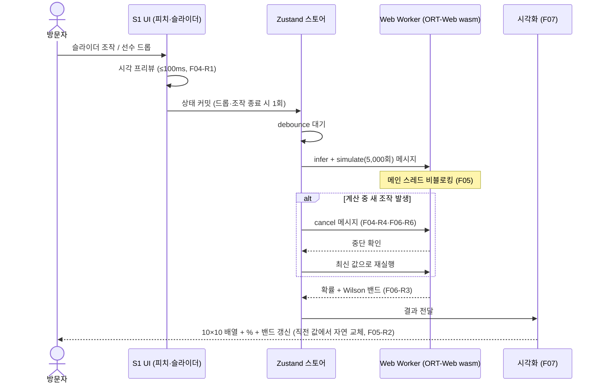
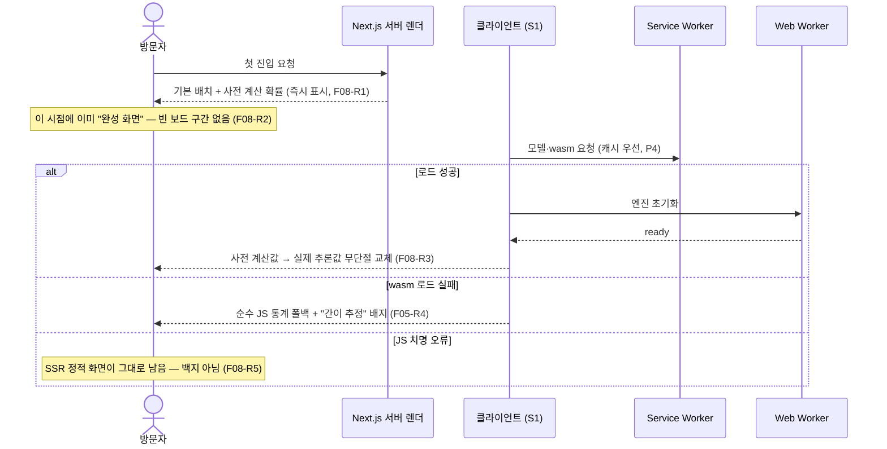
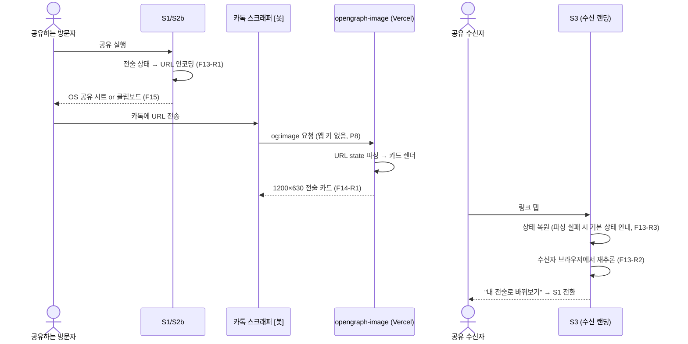
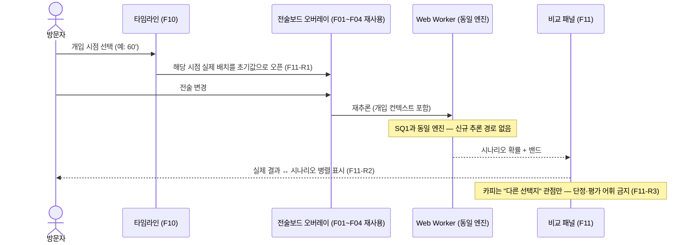

# 시퀀스 다이어그램 v1.0 — 핵심 흐름 4종

> 기획서 골격 **8·10·12절의 원고 재료**입니다. 각 시퀀스는 EARS 요구사항 ID(Fxx-Rn)와 연결됩니다.
> 다이어그램마다 "무슨 일이 일어나는가"를 단계별로 풀어 씁니다.

---

## SQ1. 조작 → 추론 → 시각화 (핵심 루프)

**해설** — 이 루프가 서비스의 심장입니다.
1. 조작 즉시 보이는 것은 **프리뷰**(가벼운 시각 효과)이고, 확률 계산은 debounce 뒤에 따로 돕니다. 둘을 분리했기 때문에 100ms 조작감(P5)과 무거운 시뮬레이션이 공존할 수 있습니다.
2. `cancel` 분기가 핵심 예외 처리입니다 — 이것이 없으면 빠르게 조작할 때 **옛 계산 결과가 나중에 도착해 최신 화면을 덮어쓰는** 버그(경쟁 상태)가 생깁니다 (F04-R4).
3. 전 과정에서 서버 호출이 0건입니다 (F05-R3).

## SQ2. 초기 로딩·폴백 (빈 화면 금지의 구현)

**해설** — "로딩 중"을 사용자에게 기다리게 하지 않는 구조입니다.
1. 서버가 먼저 **완성된 화면**(기본 전술+사전 계산 확률)을 보냅니다. 모델은 그 뒤에서 조용히 로드됩니다.
2. 실패 경로가 2단입니다: wasm만 실패하면 JS 폴백으로 **기능을 유지**하고, JS 전체가 죽어도 서버 렌더 화면이 남아 **백지가 뜨지 않습니다**. 심사 중 어떤 환경에서도 "안 열리는 서비스"가 되지 않게 하는 방어선입니다.

## SQ3. 공유 생성 → 카톡 스크랩 → 수신 재추론 (서버 무저장)

**해설** — 서버에 아무것도 저장하지 않고 공유가 성립하는 구조입니다.
1. URL 자체가 전술의 전부입니다(TACTIC_STATE 엔티티, 데이터_설계 §1). 서버 DB가 없으므로 유실·유출될 데이터도 없습니다.
2. 카드 이미지는 스크래퍼가 요청할 때 그때그때 서버 렌더됩니다 — 사용자 행동이 필요 없어 **카톡 미리보기가 앱 키 없이** 성립합니다 (P8, "키 없이 심사" 규칙 정합).
3. 수신자의 확률은 수신자 기기에서 **다시 계산**됩니다 — 결과를 전송하는 게 아니라 상태를 전송하기 때문에 조작(변조)되어도 F13-R3~R6이 안전하게 흡수합니다.

## SQ4. 리플레이 개입 재예측 (엔진 재사용)

**해설** — 리플레이 개입은 새 기능이 아니라 **기존 루프(SQ1)의 재사용**입니다.
1. 오버레이가 여는 전술보드는 S1과 같은 컴포넌트, 추론 엔진도 같은 Worker입니다. 코드 경로가 하나라서 완성도 리스크(동적 인터랙션 미작동 = 평가 제외)가 절반이 됩니다.
2. 비교 패널의 문장 규칙(F11-R3)이 비하 금지 규칙의 마지막 방어선입니다 — 구조적으로 확률만 표시하고, 단정 문장은 컴포넌트에 존재하지 않습니다.

---

## 체크리스트

- [x] 4개 시퀀스 전부 EARS 요구사항 ID와 연결
- [x] 각 다이어그램에 풀어쓴 해설 병기 (쉽고 상세하게 원칙)
- [x] 취소·폴백·변조 등 예외 경로가 다이어그램에 명시됨
- [x] 실명·연상 표기 0건 / 비하 카피 0건
