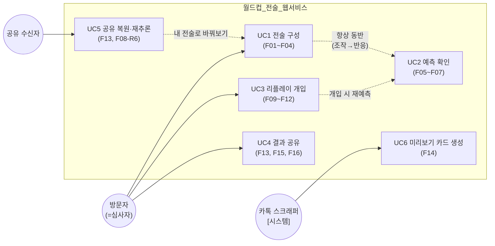

# 유스케이스 v1.0

> 기획서 골격 **4·11절의 원고 재료**입니다. 각 유스케이스는 기능 문서(F01~F16)와 상호 참조됩니다.
> 다이어그램은 mermaid — GitHub에서 바로 렌더됩니다.

---

## 1. 액터 정의 — 누가 이 시스템을 쓰는가

| 액터 | 정의 | 특징 |
|---|---|---|
| **방문자** | URL로 진입한 익명 사용자 | 회원가입·로그인 없음(ADR-001). **심사자도 동일 액터** — 심사자 전용 경로를 따로 만들지 않는 것이 설계 원칙(별도 경로가 있으면 "심사용으로만 동작"하는 위장 리스크) |
| **공유 수신자** | 공유 URL로 진입한 방문자 | 진입 순간부터는 방문자와 동일 — 상태만 URL에서 복원됨 |
| **카톡 스크래퍼** (시스템 액터) | OG 태그를 읽는 외부 봇 | 사람이 아니지만 F14의 실제 호출자. 80/443 포트로 `og:image` 요청 (P8) |

**관리자 액터가 없는 이유**: [ADR-001](../../decisions/ADR-001-역할범위.md) — 콘텐츠가 정적 JSON이라 운영 수단은 git 커밋이며, "가입 없이 심사" 규칙과 8/3 저장소 동결 조건에 정합. 관리자 콘솔은 12일 일정에서 완성도 리스크만 추가.

## 2. 유스케이스 다이어그램

### 읽는 법 (해설)

- **UC1→UC2 점선**: 전술 구성과 예측 확인은 별개 행위가 아니라 **항상 붙어 다니는 쌍** — 조작하면 반드시 반응이 온다(P5의 "조작→반응 1~2초 내 발견" 원칙). 이 쌍이 서비스의 핵심 루프
- **UC5→UC1 점선**: 공유 수신자가 "내 전술로 바꿔보기"를 누르는 순간 방문자와 같은 루프에 진입 — **바이럴 루프의 접합점** (P8)
- **UC6의 액터가 봇**: 사람이 아무 행동을 하지 않아도(링크만 붙여넣어도) 카드가 생성됨 — 앱 키 없이 성립하는 이유 (P8)

## 3. 유스케이스별 사전·사후 조건 요약

| UC | 사전 조건 | 사후 조건 | 실패 시(대표) |
|---|---|---|---|
| UC1 전술 구성 | S1 렌더 완료(기본 상태 F08) | 전술 상태 커밋 | 드래그 취소 시 원위치 (F02-R4·R5) |
| UC2 예측 확인 | UC1 커밋 or 진입 기본값 | 확률+밴드 표시 | wasm 실패 → JS 폴백 배지 (F05-R4) |
| UC3 리플레이 개입 | 경기 선택(F09) | 실제 vs 시나리오 병렬 비교 | 잘못된 matchId → 선택 화면 (F09-R3) |
| UC4 결과 공유 | 시뮬레이션 결과 존재 | URL/카드/그리드 배포 | Web Share 미지원 → 클립보드 (F15-R4) |
| UC5 공유 복원 | 유효 상태 URL | 복원+재추론 완료 | 파싱 실패 → 기본 상태 안내 (F13-R3) |
| UC6 카드 생성 | 스크래퍼의 URL 요청 | 1200×630 카드 응답 | 생성 실패 → 정적 폴백 (F14-R4) |

## 4. 심사 기준과의 연결 (기획서 인용용)

- UC1+UC2 쌍 = **감동 경험 25점**("조작의 직관성")의 무대
- UC2의 온디바이스 실행 = **참신성 30점**(P1 시장 공백) + "키 없이 심사" 충족
- UC3 = **참신성**의 두 번째 축(문제의식 3절의 인터랙티브 응답)
- UC4~UC6 = **1차 대중투표** 전략(P8) — 심사 배점 밖이지만 선결 조건

## 체크리스트

- [x] 모든 UC가 F ID와 상호 참조
- [x] 관리자 액터 부재의 근거 명시(ADR-001)
- [x] 실명·연상 표기 0건 / 비하 카피 0건
