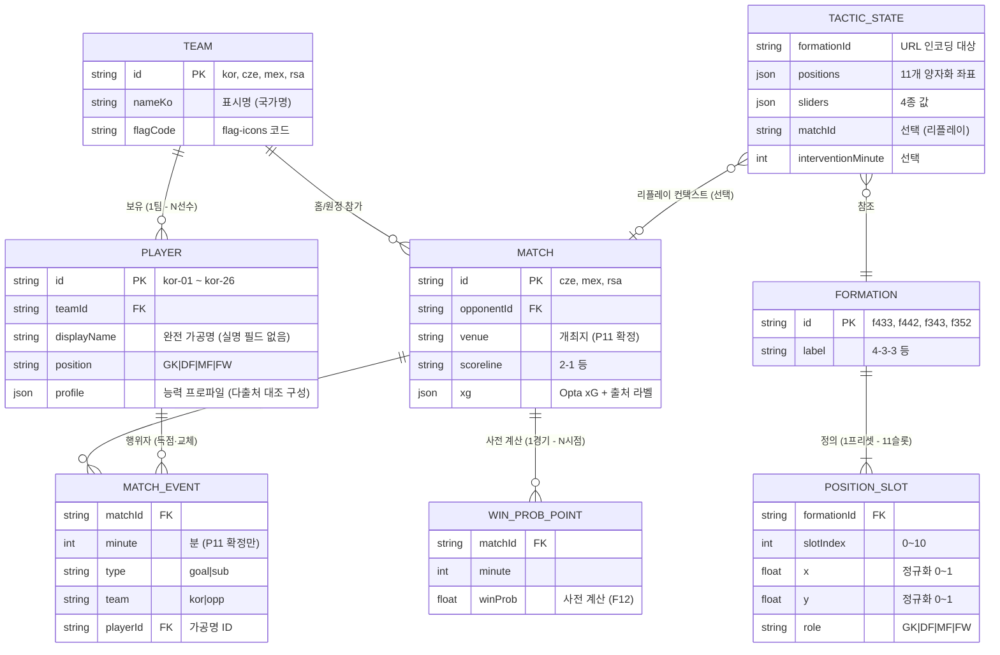

# 데이터 설계 v1.0 — ERD·JSON 스키마·제작 절차

> 기획서 골격 **9절(데이터 활용 방식)의 원고 재료**이자 `src/data/` 구현의 직접 입력입니다.
> 가공명 규칙은 [가공명_체계_v1_0.md](가공명_체계_v1_0.md), 구성 방식 결정은 [ADR-005](../../decisions/ADR-005-가공명과_데이터_구성.md) 참조.
> 표기 규약(Pn·ADR·[설계 결정])은 [기능명세 인덱스](../../features/version1.0/기능명세_인덱스_v1_0.md)와 동일.

---

## 0. 왜 DB가 아니라 정적 JSON인가 (설계 배경)

이 서비스에는 데이터베이스 서버가 없습니다. 그런데도 ERD를 그리는 이유는 **"저장 기술과 데이터 모델은 별개"** 이기 때문입니다.

1. **대회요강 정합**: 주최 측이 "더미 데이터를 직접 구성… 하드 코딩하거나 JSON 형태로 구성"을 권장 (대회요강 171~172행)
2. **심사 조건 정합**: DB·백엔드가 없으면 "키 없이·가입 없이 심사" 조건이 구조적으로 충족되고, 장애 지점도 사라짐
3. **운영 모델 정합**: 콘텐츠 수정 = git 커밋 (ADR-001) — 8/3 저장소 동결 이후 데이터가 변할 일이 없음

즉 아래 ERD는 "테이블 설계도"가 아니라 **JSON 파일들이 지켜야 할 관계 규칙**입니다.
관계가 어긋나면(예: 존재하지 않는 선수 ID를 이벤트가 참조) 화면이 깨지므로, DB의 외래 키가 하던 역할을 **빌드 타임 검증 스크립트**가 대신합니다(§4).

---

## 1. ERD (엔티티 관계도)



### 엔티티별 해설 — 왜 이렇게 나눴는가

| 엔티티 | 물리 위치 | 왜 분리했나 |
|---|---|---|
| **TEAM / PLAYER** | `players.json` | 선수는 팀에 소속되지만, 상대 팀 선수도 리플레이 이벤트의 행위자(마세코 63' 등)이므로 4팀 전체를 동일 스키마로 관리. `displayName`은 가공명만 — **실명을 담을 필드 자체가 없어** 스키마 수준에서 P7 위반을 차단 |
| **FORMATION / POSITION_SLOT** | `formations.json` | 프리셋(F01)은 "4-3-3"이라는 이름이 아니라 **11개 좌표의 집합**. 좌표를 정규화(0~1)해 두면 어떤 화면 크기에서도 동일 배치 (F01-R6 화면 회전 대응의 데이터 근거) |
| **MATCH / MATCH_EVENT** | `matches.json` | 이벤트는 경기의 자식. **P11 확정 이벤트만 존재** — P13 미확정(남아공전 경고)은 행 자체가 없으므로 F10-R3(미표시)이 데이터 수준에서 보장됨 |
| **WIN_PROB_POINT** | `matches.json` 내 배열 | F12 라인차트의 실제 라인은 **빌드 타임 사전 계산** — 런타임 계산이 아니어서 심사 중 실패 지점이 없음 |
| **TACTIC_STATE** | 파일 없음 (URL·메모리) | 유일하게 저장되지 않는 엔티티. 사용자가 만든 전술은 서버가 아니라 **URL에 인코딩**(F13) — "URL이 곧 저장"이 ADR-001의 무저장 원칙 |

---

## 2. JSON 파일별 스키마 (TS 타입)

> 구현 시 `src/types/data.ts`로 그대로 옮기는 것을 전제로 한 시그니처입니다. TypeScript strict 모드 기준.

### 2.1 `src/data/players.json`

```typescript
interface Team {
  id: 'kor' | 'cze' | 'mex' | 'rsa';
  nameKo: string;            // "대한민국" 등 국가명 — 국가명 표기는 허용 (P7)
  flagCode: string;          // flag-icons 코드 (MIT)
}

interface Player {
  id: string;                // "kor-01" ~ — 등번호가 아닌 일련번호 (연상 차단, ADR-005)
  teamId: Team['id'];
  displayName: string;       // 완전 가공명 — 생성·검증 규칙은 가공명_체계_v1_0.md
  position: 'GK' | 'DF' | 'MF' | 'FW';
  profile: {
    attack: number;          // 0~100 — 다출처 대조로 직접 구성한 프로파일
    defense: number;
    stamina: number;
    speed: number;
  };
}

interface PlayersFile {
  teams: Team[];
  players: Player[];         // 한국 26명 + 상대 3팀은 이벤트 관련 선수만 [설계 결정]
}
```

- `id`를 등번호로 하지 않는 이유: 등번호+포지션 조합은 실존 선수를 연상시킴(예: 7번 FW) → **일련번호** (ADR-005)
- `profile` 수치는 특정 사이트 능력치의 복제가 아니라 **다출처 대조 후 직접 산정** — 단일 소스 체계적 추출은 DB권 침해 리스크 (P10)

### 2.2 `src/data/formations.json`

```typescript
interface PositionSlot {
  slotIndex: number;         // 0(GK) ~ 10
  x: number;                 // 0~1 정규화 (좌→우)
  y: number;                 // 0~1 정규화 (자기 진영→상대 진영)
  role: Player['position'];
}

interface Formation {
  id: 'f433' | 'f442' | 'f343' | 'f352';   // ADR-003 확정 4종
  label: string;             // "4-3-3"
  slots: PositionSlot[];     // 항상 길이 11
}
```

### 2.3 `src/data/matches.json`

```typescript
interface MatchEvent {
  minute: number;            // P11 확정 분만 — 확정 안 된 이벤트는 행이 없다 (F10-R3)
  type: 'goal' | 'sub';      // 경고(card)는 P13 확정 전까지 타입 자체를 정의하지 않음
  team: 'kor' | 'opp';
  playerId: string;          // Player.id (가공명 참조) — 교체는 in/out 2행 [설계 결정]
}

interface WinProbPoint {
  minute: number;
  winProb: number;           // 0~1, 빌드 타임 사전 계산 (F12)
}

interface Match {
  id: 'cze' | 'mex' | 'rsa';
  opponentId: Team['id'];
  round: 1 | 2 | 3;
  venue: string;             // P11 확정: Estadio Akron(cze·mex) / Estadio BBVA(rsa)
  dateLocal: string;         // 현지 일자 — 체코전은 현지 6/11·KST 6/12 병기 (P11)
  dateKst: string;
  scoreline: string;         // "2-1" (한국 기준 앞)
  xg?: { kor: number; opp: number; source: 'Opta' };  // 남아공전 1.16/0.90, 라벨 필수 (P11)
  events: MatchEvent[];
  winProbTimeline: WinProbPoint[];
}
```

### 2.4 `src/data/defaults.json`

```typescript
interface Defaults {
  formationId: 'f433';                    // ADR-004
  sliders: { lineHeight: 50; pressing: 50; width: 50; tempo: 50 };  // 중앙값
  opponentMatchId: 'cze';                 // 기본 상대 = 체코 (가공명_체계에서 게이트 해소)
  precomputed: { win: number; draw: number; lose: number };  // 빌드 타임 산출 (F08-R1)
}
```

---

## 3. 데이터 제작 절차 (라이선스 방어 포함)

```
[1] 학습층: joshfjelstul/world-cup-database (CC BY-SA 4.0)
      │  실명 포함 — 학습·집계 파이프라인 내부까지만 (P10·P7)
      ▼
[2] 집계·프로파일 산정 (Python, 파이프라인 내부)
      │  + 다출처 대조 (단일 소스 체계적 추출 금지 — DB권, P10)
      ▼
[3] 가공명 배정 (무작위 + 수동 검수 — ADR-005)
      ▼
[4] src/data/*.json 출력 — 실명 필드 없음 (스키마가 차단)
      │
      └─ 검증 스크립트: ① 참조 무결성(playerId·formationId 실존 여부)
                        ② 실명·유명 선수명 유사도 검사 (가공명_체계 §3)
                        ③ 스키마 타입 검사 (Zod)
```

- **CC BY-SA 분리 고지**: 데이터셋 기반 산출물(프로파일 통계)은 저장소 `DATA-LICENSE.md`에 CC BY-SA 4.0 고지 분리 게재 (P10) `[설계 결정: 파일명]`
- 검증 스크립트는 DB 외래 키의 대체물 — CI가 아닌 **빌드 스크립트**로 실행(8/3 동결 전 최종 1회 포함)

## 4. F 문서와의 대응 (상호 일치 확인용)

| 파일 | 소비 기능 | 근거 |
|---|---|---|
| players.json | F01(토큰)·F10(이벤트 행위자) | P7·P10·ADR-005 |
| formations.json | F01·F02·F03 | ADR-003 |
| matches.json | F09·F10·F11·F12 | P11 |
| defaults.json | F08 | ADR-004·P5 |
| (TACTIC_STATE) | F13 URL 스키마 | P8 |

## 체크리스트

- [x] ERD 엔티티 ↔ JSON 스키마 ↔ F 문서 8절 데이터 요구 상호 일치
- [x] 실명 필드 부재를 스키마 수준에서 보장
- [x] P13 미확정 이벤트는 타입 자체를 정의하지 않음
- [x] `[NEEDS CLARIFICATION]` 0건 (게이트 2건은 가공명_체계에서 해소)
