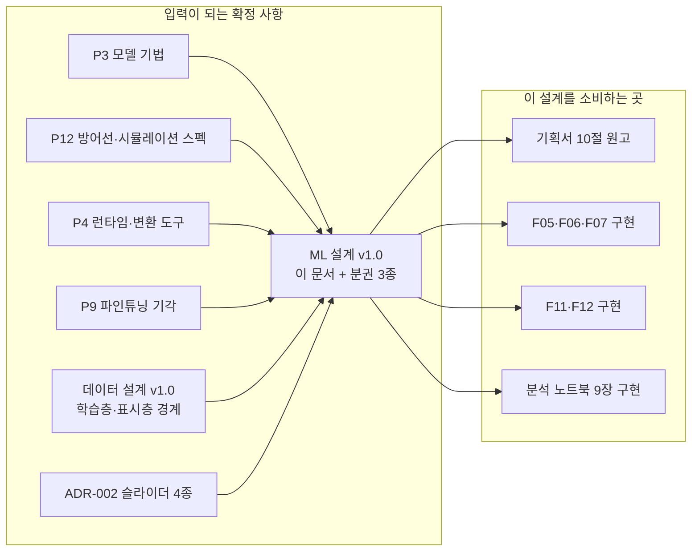
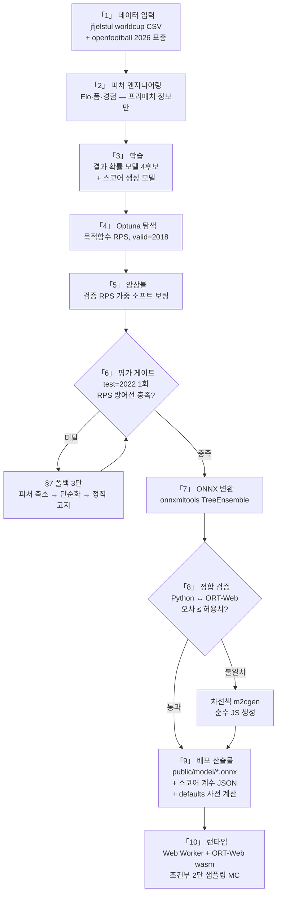

# ML 설계 v1.0 — 학습 파이프라인·모델 아키텍처·ONNX·런타임 통합

> 기획서 골격 **10절(ML/DL 아키텍처)의 원고 재료**이자, F05~F07·F11·F12의 EARS 계약을
> 학습 파이프라인 쪽에서 충족하는 방법의 정본입니다.
> 세부는 분권: [피처_정의서_v1_0.md](피처_정의서_v1_0.md) · [평가_설계_v1_0.md](평가_설계_v1_0.md) ·
> [노트북_서사_v1_0.md](노트북_서사_v1_0.md). 결정 기록: ADR-006(아키텍처)·007(검증 분할)·008(슬라이더 매핑).
> 표기 규약(Pn·ADR·[설계 결정]·[추정 설계목표])은 [기능명세 인덱스](../../features/version1.0/기능명세_인덱스_v1_0.md)와 동일.

---

## 0. 이 문서의 위치 — 무엇을 소비하고 무엇에게 공급하는가



**해설** — 이 문서는 리서치 확정값(P3·P4·P9·P12)과 선행 설계(데이터 설계·ADR-002)를 입력으로
받아, **"어떤 데이터로 무엇을 학습해 어떻게 브라우저까지 보내는가"** 를 확정합니다. 산출물의
1차 소비처는 기획서 10절이고, 2차 소비처는 구현(예측 패널·시뮬레이션·리플레이)과 분석
노트북입니다. 기능 명세(F05~F07)가 "무엇이 되어야 하는가"라면, 이 문서는 "그것이 실제로
가능한 이유와 만드는 순서"입니다.

## 1. 설계 목표와 제약 — 심사 조건 역매핑

| # | 제약 | 이 설계에서의 구현 | 근거 |
|---|---|---|---|
| C1 | 심사자 별도 키·서버 없이 동작 | 온디바이스 추론 — ONNX + ORT-Web wasm 서브셋, 외부 API 0건 | P4 · F05-R3 |
| C2 | 직접 학습 (파인튜닝 기각) | 모든 모델을 자체 학습 — "라이선스는 파인튜닝으로 세탁되지 않는다" | P9 |
| C3 | 성능 방어선 | 테스트 RPS 0.19~0.22 / 정확도 0.50~0.55 목표. arXiv 0.127 인용 금지 | P12 |
| C4 | 실명 경계 | 실명은 학습 파이프라인 내부까지만 — 커밋·클라이언트 산출물에 0건 | P7·P10·ADR-005 |
| C5 | 라이선스 고지 | 데이터셋 기반 산출물은 CC BY-SA 4.0 분리 고지 | P10 |
| C6 | 지연 예산 | 단일 추론 ≤50ms `[추정 설계목표]` · 빠른 5,000회 ≤1초 목표 · 정밀 25,000회 ≤10초 | P4·P5·P12 |
| C7 | 8/3 저장소 동결 | 학습·변환·검증 전체가 동결 전 완료 가능한 규모로 설계 | 대회 규칙 |

**설계 근거** — 이 표가 맨 앞에 오는 이유는, ML 설계의 모든 후속 선택(모델 크기·검증 방식·
배포 형태)이 결국 이 7개 제약의 동시 충족 문제이기 때문입니다. 예컨대 "더 큰 모델"은 C3에
유리해 보여도 C6(추론 지연)·C7(일정)을 위협하므로, 아래 §4는 처음부터 경량 후보만 다룹니다.

## 2. 파이프라인 전체 구조



**단계별 해설 — 무엇을/왜/어떻게**

1. **데이터 입력**: 학습의 유일한 1차 소스는 `jfjelstul/worldcup`(CC BY-SA 4.0, P10 채택).
   2026 조별리그 스코어 표층은 openfootball(퍼블릭 도메인, P2)로 보충하되 **평가가 아니라
   입력(Elo 연장·리플레이 컨텍스트)에만** 씁니다(ADR-007 Consequences). 상세는 §3.
2. **피처 엔지니어링**: 모든 피처는 해당 경기 킥오프 이전 정보만으로 계산합니다(리키지 방지,
   ADR-007). 카탈로그는 [피처_정의서_v1_0.md](피처_정의서_v1_0.md).
3. **학습**: 두 갈래를 병렬로 — 승/무/패 결과 확률 모델(주선)과 스코어 생성 모델(보조).
   구조와 결합 방식은 §4(ADR-006).
4. **Optuna**: 탐색 목적함수는 정확도가 아니라 **RPS**입니다. 방어선이 RPS로 정의되어
   있고(P12), 정확도는 확률 품질을 보지 못하는 지표이기 때문입니다(평가_설계 §2).
5. **앙상블**: 검증(2018) RPS 기반 가중 소프트 보팅. 스태킹은 valid 64경기로는 메타 모델
   과적합 위험이 커서 채택하지 않습니다 `[설계 결정]`.
6. **평가 게이트**: 테스트(2022)는 단 1회. 미달이면 §7 폴백 3단을 거쳐 재도전하되,
   재도전 역시 valid 기준으로 조정한 뒤 test는 최종 1회만 다시 봅니다.
7. **ONNX 변환**: 앙상블 멤버별 변환 — 절차와 도구는 §5.1.
8. **정합 검증**: 변환 후 모델이 학습 시와 같은 확률을 내는지 수치로 검증합니다(§5.2).
   이 단계가 없으면 "학습은 잘했는데 브라우저에서 다른 값이 나오는" 침묵 실패를 놓칩니다.
9. **배포 산출물**: 모델·계수·기본값 사전 계산치가 전부 정적 파일 — 서버 의존 0 (C1).
10. **런타임**: F05~F07이 소비하는 Worker 계약으로 연결됩니다(§6).

## 3. 데이터 입력층

### 3.1 로컬 자체 검증 (2026-07-23)

자체 리서치 체제(원장 개정 이력 2026-07-22)에 따라, 설계 전 데이터셋 실체를 gh api로 직접
검증했습니다. 검증 커맨드와 결과 요지:

- `gh api repos/jfjelstul/worldcup` → 레포 실존, 328★, 설명 "A Comprehensive Database on the FIFA World Cup"
- `gh api repos/jfjelstul/worldcup/contents/data-csv` → **CSV 테이블 27종 전수 확인**:
  matches, team_appearances, goals, substitutions, bookings, penalty_kicks, squads, players,
  teams, tournaments, tournament_standings, group_standings, stadiums, managers 외
- `tournaments.csv` 실측 → 남자 WC **1930~2022 (22개 대회)** + 여자 WC 1991~2019 (8개 대회)
- `matches.csv`·`team_appearances.csv` 헤더 실측 → 스코어·스테이지·홈/원정·승무패 컬럼 완비.
  **전술 성향(포메이션·라인·압박 등) 컬럼은 존재하지 않음** → ADR-008의 사실 근거

### 3.2 사용 테이블과 용도

| 테이블 | 용도 | 비고 |
|---|---|---|
| `matches` / `team_appearances` | 경기 결과·스코어 — 학습 라벨과 Elo·폼 산출의 원천 | 팀 수준, **실명 불요** |
| `tournaments` | 대회 연도·개최국 — 분할 기준(ADR-007)·개최국 피처 | |
| `goals` | 득점 분 — 보조 검증(시점별 캘리브레이션, 평가_설계 §5) | 선수명 포함 → 마스킹 경계 적용 |
| `squads` / `players` | 표시층 프로파일 산정 입력 | **비커밋 로컬 파이프라인 전용** (ADR-005) |

### 3.3 학습층 경계 — 3분할

데이터 설계 v1.0 §3의 "학습층은 파이프라인 내부까지"를 ML 관점에서 한 단계 더 쪼갭니다.
핵심 관찰: **모델 학습 자체는 팀 수준 데이터만 필요해서 실명이 필요 없습니다.**

| 구획 | 실명 취급 | 저장소 커밋 | 내용 |
|---|---|---|---|
| ① 모델 학습 | 불요 (팀 수준) | 커밋 (노트북·설정) | 결과 확률·스코어 모델 학습 전체 |
| ② 프로파일·가공명 산정 | 필요 | **비커밋 로컬** | players.json 프로파일 다출처 대조, 가공명 배정표 (ADR-005) |
| ③ 분석 노트북 | 로드 직후 마스킹 | 커밋 (공개 문서) | 실명 컬럼→ID 치환 셀을 01장 서두에 배치 ([노트북_서사 §4](노트북_서사_v1_0.md)) |

**설계 근거** — "실명은 파이프라인 내부까지"(P7·P10)라는 문장은 노트북을 공개 저장소에
커밋하는 순간 재해석이 필요해집니다. 노트북은 파이프라인이면서 동시에 **공개 문서**이기
때문입니다. 실명이 필요한 작업(②)을 비커밋 구획으로 분리하고, 커밋되는 구획(①③)은 실명이
구조적으로 등장할 수 없게 만들면 이 긴장이 해소됩니다. 국가명 표기는 허용입니다(P7).

### 3.4 라이선스 고지

- 데이터셋 기반 산출물(모델 가중치·집계 통계·노트북 그림)은 `DATA-LICENSE.md`에
  **CC BY-SA 4.0 분리 고지** (P10, 데이터 설계 §3과 동일 파일)
- openfootball은 퍼블릭 도메인(P2) — 고지 의무는 없으나 출처 명기는 유지 `[설계 결정]`

## 4. 모델 아키텍처 (ADR-006 상세)

### 4.1 결과 확률 모델 (주선) — 승/무/패 3-class

| 항목 | 확정 내용 | 근거 |
|---|---|---|
| 후보 | LightGBM · XGBoost · CatBoost (경량 GBDT 3종) + 로지스틱 회귀 기준선 | P3·P12·노트북 서사 |
| 기준선 | Elo 차이 covariate 로지스틱 — 공개 실측에서 RPS 0.21대의 검증된 baseline | P12 |
| 튜닝 | Optuna TPE, 목적함수 = valid RPS, 모델당 100 trial `[설계 결정]` | 평가_설계 §2 |
| 앙상블 | 검증 RPS 가중 소프트 보팅 — w_i ∝ 1/RPS_i 정규화 `[설계 결정]` | §2 해설 5 |
| 크기 제약 | 트리 수 ≤400·깊이 ≤6/모델 `[설계 결정]` — ONNX 크기·추론 지연 통제 | C6·P4 |

**설계 근거** — GBDT 3종을 모두 학습하는 것은 성능 경쟁이 목적이 아니라 ① 노트북 서사의
비교 구조(3장→5장) ② 앙상블 다양성 ③ ONNX 변환 실패 시 대체 후보 확보의 3중 목적입니다.
로지스틱 기준선은 "복잡한 모델이 기준선을 정말 이기는가"를 매 단계 확인하는 정직성 장치이며,
GBDT가 기준선을 못 이기면 §7의 "모델 단순화"가 오히려 기본 경로가 됩니다.

### 4.2 스코어 생성 모델 (보조) — bivpois λ + Dixon-Coles τ

득점을 포아송 과정으로 보고 팀별 기대득점 λ를 추정합니다 (P12 채택 스택):

```
λ_home = exp(β₀ + β₁·(Elo_home − Elo_away) + β₂·form_home + β₃·host_home + …)
λ_away = exp(β₀' + β₁'·(Elo_away − Elo_home) + …)
P(score = x-y) = Pois(x; λ_home) · Pois(y; λ_away) · τ(x, y)
```

- **τ 보정**: Dixon-Coles의 저점수(0-0·1-0·0-1·1-1) 의존성 보정 항. 파라미터 ρ는 학습 데이터
  MLE로 추정 (P3·P12)
- **λ 회귀는 닫힌 수식(포아송 회귀)** — 계수 십수 개를 JSON으로 내보내면 JS에서 그대로 계산
  가능. ONNX 변환이 필요 없어 변환 리스크가 주선 1개로 줄어듭니다 (ADR-006)
- 스코어 격자는 팀당 0~6골로 절단 `[설계 결정]` — 월드컵 7골+ 경기는 극희소이며, 유한 격자로
  만들어야 조건부 정규화(§4.3)가 단순한 표 연산이 됩니다

### 4.3 결합 — 조건부 2단 샘플링

몬테카를로 1회의 절차:

```
① 결과 범주 r ~ Categorical(p_win, p_draw, p_lose)   ← ONNX 단일 추론값 p
② 스코어 (x, y) ~ P(x, y | r)                        ← λ·τ 격자에서 r과 일치하는
                                                        칸만 남겨 재정규화한 분포
```

**왜 이 순서인가** — 몬테카를로 집계 확률 p̂은 ①에서 뽑힌 범주의 빈도이므로 **N→∞에서
정확히 p로 수렴**합니다(수식 논증: [평가_설계 §4](평가_설계_v1_0.md)). 즉 화면의 퍼센트
숫자(단일 추론)와 10×10 배열·밴드(MC 집계)가 어긋날 수 없습니다 — F07 수용 기준 "상호
불일치 0"이 구현 품질이 아니라 **구조**로 보장됩니다. 스코어 표현력(HOPs 프레임의 "2-1",
"0-0")은 ②가 공급합니다.

**두 모델의 정합 관리** — 분류 p와 λ 격자에서 유도한 확률 p_λ의 괴리(총변동 거리)를 학습
단계 정합 지표로 모니터링합니다. 괴리 임계 초과 시 λ 회귀에 캘리브레이션 항을 추가합니다
`[설계 결정]` (평가_설계 §2.4).

### 4.4 추론 컨텍스트 2종 — 프리매치와 인매치

| 컨텍스트 | 소비 기능 | 사용 모델 | 확률의 정의 |
|---|---|---|---|
| **프리매치** — 전술보드 S1 | F05·F06·F07 | 분류 p + 조건부 2단 샘플링 | 단일 추론 p (MC는 p로 수렴) |
| **인매치** — 리플레이 S2b | F11·F12 | 스코어 모델 잔여 시간 샘플링 | MC 집계 그 자체 |

인매치 추론: 경기 t분 시점에서 현재 스코어를 고정하고, 잔여 시간 기대득점을
λ_remain = λ·(90−t)/90 로 스케일링해 잔여 득점을 샘플링합니다 `[설계 결정: 균등 강도 근사]`.
분류 모델은 프리매치 피처(경기 전 정보)로 학습되므로 인매치에는 쓰지 않습니다 — 인매치의
표시 확률은 MC 집계 자체가 정의라서 F07 불일치 문제가 발생하지 않습니다.

- **F12 사전 계산**: 실제 3경기의 winProbTimeline은 위 산식으로 **빌드 타임에** 이벤트 분마다
  계산해 `matches.json`에 포함 (F12 [설계 결정]과 정합 — 런타임 실패 지점 없음)
- **F11 개입 재추론**: 같은 산식에 개입 전술의 조정 계층(ADR-008)을 λ에 적용해 **런타임**
  재계산 — F05·F06 엔진 재사용 원칙(SQ4) 유지

## 5. ONNX 변환·배포

### 5.1 변환 절차

1. 앙상블 멤버별로 `onnxmltools`(LightGBM·XGBoost)·`skl2onnx`(로지스틱) 변환 —
   TreeEnsemble·LinearClassifier는 `ai.onnx.ml` 표준 연산자 (P4)
2. 앙상블 가중 평균은 **Worker JS에서 수행** `[설계 결정]` — 멤버별 세션을 돌리고 가중합.
   단일 그래프 병합보다 단순하고, 멤버 제외(§5.4 예산 초과 대응)가 파일 삭제로 끝남
3. 스코어 모델 계수·τ 파라미터·전술 조정 계층 상수는 `public/model/score-params.json`으로 배포

### 5.2 정합 검증 (변환 게이트)

- 검증 케이스: train·valid·test에서 층화 추출한 1,000경기 + 슬라이더·포메이션 경계값 조합
  (전 슬라이더 0/50/100, 4개 프리셋) `[설계 결정]`
- 합격 기준: Python 확률 vs ORT-Web(Node 테스트 하니스) 확률 **최대 절대 오차 ≤ 1e-4**
  `[설계 결정]` — float32 변환 오차 상회, 확률 표시 소수 1자리에 충분한 여유
- 조정 계층은 Python·JS 이중 구현이므로(ADR-008 Consequences) 같은 케이스로 대조

### 5.3 실패 시 차선책 — m2cgen

정합 검증 실패 또는 wasm 계열 이슈 시, **m2cgen으로 순수 JS 코드 생성**(런타임 의존성 0)으로
전환합니다 (P4 차선책). 이 경우 ORT-Web 로드 자체가 사라지므로 F05-R4의 wasm 실패 분기가
구조적으로 소멸하는 이점도 있습니다. 전환 판단 기한: 구현 P0 종료 시점 `[설계 결정]`.

### 5.4 번들 예산

| 자산 | 예산 | 근거 |
|---|---|---|
| ort.wasm.min.js (JS 로더) | raw-min 약 47KB | P4 실측 |
| .wasm 바이너리 + 모델 합계 | 총 ≤5MB, 모델 onnx 합계 ≤1MB `[추정 설계목표, 실측 필요]` | P4 — non-threaded 선택, Service Worker 캐싱 전제 |
| score-params.json | ≤10KB `[추정 설계목표]` | 계수 수십 개 수준 |

**IF 예산 초과 THEN** 앙상블 멤버를 검증 RPS 손실 최소 순으로 제외 → 트리 수 축소 →
m2cgen 전환 순으로 대응합니다 (ML-R7).

## 6. 런타임 통합 — F 계약과의 대응

### 6.1 Worker 메시지 프로토콜 (F05·F06 공유 프로토콜의 구체화)

```typescript
// 메인 → Worker
type WorkerRequest =
  | { type: 'init' }                                        // 엔진 초기화
  | { type: 'infer'; payload: TacticContext }               // 단일 추론 (F05)
  | { type: 'simulate'; payload: TacticContext & { iterations: 5000 | 25000 } }  // MC (F06)
  | { type: 'replay'; payload: InterventionContext }        // 인매치 재추론 (F11)
  | { type: 'cancel' };                                     // 취소 (F04-R4·F06-R4)

// Worker → 메인
type WorkerResponse =
  | { type: 'ready' }                                                   // F08-R3 교체 신호
  | { type: 'result'; payload: { p: [number, number, number]; wilson: Band; frames: Frame[] } }
  | { type: 'progress'; payload: { done: number; total: number } }      // 청크 경계 보고 (F06-R2)
  | { type: 'cancelled' }
  | { type: 'error'; payload: { stage: 'load' | 'infer' | 'simulate' } }; // 폴백 트리거 (F05-R4·R6)
```

MC는 청크 단위(500회 `[설계 결정]`, F06 §4 정합)로 진행 보고하며, `cancel`은 청크 경계에서
즉시 반영됩니다 — 취소 지연 상한이 청크 1개 계산 시간으로 유계.

### 6.2 F 계약 대응표 — 요구 ↔ 이 설계의 공급 (계약 누락 검수용)

| 계약 | 요구 | 이 설계의 공급 |
|---|---|---|
| F05-R1 | 커밋 시 Worker 추론 | §6.1 `infer` + §4.4 프리매치 컨텍스트 |
| F05-R2 | 직전 값 유지 | `result` 도착 시에만 교체 — 프로토콜상 중간 상태 없음 |
| F05-R3 | 외부 요청 0건 | §5 배포 산출물 전부 정적 파일 (C1) |
| F05-R4 | wasm 실패 폴백 | §6.3 JS 통계 폴백 산식 + `error(load)` 트리거 |
| F05-R5 | 로드 전 조작 허용 | `init`→`ready` 분리 — ready 전 조작은 큐잉 후 최신 상태만 추론 |
| F05-R6 | Worker 무응답 재기동 | `error`/타임아웃 → 재기동 1회 → §6.3 폴백 |
| F06-R1~R3 | 5,000/25,000·진행률·Wilson | §6.1 `simulate`·`progress` + §4.3 샘플링 + 평가_설계 §4 밴드 |
| F06-R4~R6 | 취소·10초·재실행 | 청크 경계 취소 + `cancelled` 후 재`simulate` |
| F06-R7 | 저성능 자동 강등 | 반복 수 절반 강등 — 표본 오차 영향은 평가_설계 §4.3에 명시 |
| F07 전체 | 배열·밴드·HOPs 데이터 | §4.3 — p 수렴 보장 + `frames`(각 프레임=MC 1회 스코어) |
| F11-R2 | 개입 재예측 | §6.1 `replay` + §4.4 인매치 산식 + ADR-008 조정 계층 |
| F12-R1·R2 | 실제 라인·시나리오 라인 | §4.4 — 빌드 타임 사전 계산 + 런타임 `replay` 재계산 |

### 6.3 JS 통계 폴백 산식 확정 — F05-R4 "간이 추정"의 실체

F05는 폴백의 존재만 명세하고 산식은 비워 두었습니다. 여기서 확정합니다 `[설계 결정]`:

```
E = 1 / (1 + 10^(−Δ/400))          // Elo 표준 기대승률, Δ = 조정 후 Elo 차이
p_draw = d̂                          // 학습 데이터 실측 무승부 빈도 (빌드 타임 산출 상수)
p_win  = (1 − d̂) · E
p_lose = (1 − d̂) · (1 − E)
```

- Elo 기대승률 산식은 Elo 레이팅의 표준 정의 (P3 Elo 계열 근거)이며 순수 JS 즉시 계산
- **전술 조정 계층(ADR-008)은 폴백에서도 동일 적용** — Δ가 조정을 받으므로 폴백 모드에서도
  슬라이더 조작→확률 변화가 유지됩니다 (F04 GWT가 폴백에서도 성립)
- Wilson 밴드 계산은 원래 순수 JS(P12)이므로 폴백과 무관하게 동작
- 한계: 폼·경험 피처가 빠진 간이 추정 — 그래서 화면에 "간이 추정" 배지가 붙습니다 (F05 §3)

## 7. 실패·폴백 — 단계적 대응

### 7.1 학습 성능이 방어선 미달일 때 (3단)

| 단계 | 조치 | 판단 기준 |
|---|---|---|
| 1단 피처 축소 | 기여 낮은 피처 제거, Elo·폼 코어만 재학습 — 소표본에서 피처 과다는 과적합 주범 (P3 §5) | valid RPS 개선 여부 |
| 2단 모델 단순화 | 앙상블 → 단일 최량 GBDT → 로지스틱 기준선 순 강등 — 기준선 자체가 RPS 0.21대 공개 실측 계열 (P12) | valid RPS·복잡도 대비 |
| 3단 정직 고지 | 그래도 미달이면 **측정값을 그대로 공개**하고 아래 문구 계열로 서술 | — |

**3단 정직 고지 문구 초안** (기획서 10절·15절용, 비하·과장 없음):

> "본 모델의 테스트 성능은 RPS X.XXX로, 목표 방어선(0.19~0.22)에 도달하지 못했습니다.
> 국가대표팀 경기는 표본이 근본적으로 부족하며(A매치 연 8~12경기, P3), 이 한계는 모델
> 고도화가 아니라 데이터의 성질에서 옵니다. 본 서비스는 확률을 단정이 아닌 탐색의 도구로
> 제시하며, 시뮬레이션 반복 횟수와 신뢰구간을 항상 병기해 불확실성을 숨기지 않습니다."

**설계 근거** — 방어선 미달을 숨기거나 측정 조건을 바꿔 재측정하는 것은 기획/구현 일관성
20점과 신뢰를 함께 잃는 길입니다. "한계를 먼저 밝히는 것이 신뢰도를 높인다"(기획서 골격
10절 확정 사항)를 실패 경로에도 그대로 적용합니다.

### 7.2 그 외 실패 경로 종합

| 실패 | 대응 | 정의 위치 |
|---|---|---|
| ONNX 정합 검증 실패 | m2cgen 순수 JS 전환 | §5.3 |
| 번들 예산 초과 | 멤버 제외 → 트리 축소 → m2cgen | §5.4 |
| openfootball 2026 표층 결측·불일치 | Elo 연장 생략, 2022 레이팅+감쇠 사용 + 문서 고지 | 피처_정의서 §3.4 |
| 실명 유출 검사 실패 | 빌드 중단 (배포 산출물 생성 금지) | §8 ML-R6 |
| 런타임 wasm/Worker 실패 | §6.3 폴백 (F05-R4·R6 계약) | §6.3 |

## 8. 요구사항 (EARS) — 파이프라인 수준

| ID | 패턴 | 요구사항 |
|---|---|---|
| ML-R1 | WHEN | **WHEN** 학습 파이프라인이 완료되면, 시스템은 분할 기준(ADR-007) 테스트 지표(RPS·정확도·캘리브레이션)를 노트북 09장 보고서로 산출한다 |
| ML-R2 | Ubiquitous | 파이프라인은 모든 피처를 해당 경기 킥오프 이전 정보만으로 계산한다(리키지 0) |
| ML-R3 | Ubiquitous | 커밋되는 산출물(노트북·모델·JSON)에는 선수 실명이 0건이다 — 실명 취급은 비커밋 구획(§3.3 ②)에 한정한다 |
| ML-R4 | IF-THEN | **IF** 테스트 RPS가 0.22를 초과(방어선 미달)하면, **THEN** 시스템은 §7.1 폴백 3단을 순서대로 적용하고 각 단계의 valid 수치를 보고서에 기록한다 |
| ML-R5 | IF-THEN | **IF** ONNX 정합 검증에서 최대 절대 오차가 1e-4를 초과하면, **THEN** 시스템은 해당 모델의 배포를 중단하고 m2cgen 경로로 전환한다 |
| ML-R6 | IF-THEN | **IF** 배포 산출물 실명 검사(가공명_체계 §3 검증 스크립트 계열)가 실패하면, **THEN** 시스템은 빌드를 중단하고 산출물을 생성하지 않는다 |
| ML-R7 | IF-THEN | **IF** 모델 자산 합계가 번들 예산(§5.4)을 초과하면, **THEN** 시스템은 검증 RPS 손실 최소 순으로 앙상블 멤버를 제외한다 |
| ML-R8 | IF-THEN | **IF** 분류 p와 스코어 모델 유도 확률의 괴리가 정합 임계를 초과하면, **THEN** 시스템은 λ 회귀에 캘리브레이션 항을 추가해 재학습한다 (§4.3) |

## 9. 수용 기준 (Given-When-Then)

- **Given** 확정 파이프라인·고정 시드 **When** 전체 재실행 **Then** 테스트 RPS·정확도가 보고서 수치와 일치한다 (재현성)
- **Given** 변환된 ONNX + 검증 케이스 1,000건 **When** Python↔ORT 대조 **Then** 최대 절대 오차 ≤ 1e-4
- **Given** 커밋된 저장소 **When** 공개 파일 전수 실명 검색 **Then** 실명 0건 (비커밋 구획 제외)
- **Given** 기본 전술 상태 **When** 브라우저 단일 추론 **Then** p 3원소의 합이 1±1e-6이고 소요 ≤50ms `[추정 설계목표, QA 실측]`
- **Given** wasm 강제 차단 **When** 슬라이더 조작 **Then** §6.3 폴백 확률이 표시되고 조작에 따라 변화한다

## 체크리스트

- [x] `[NEEDS CLARIFICATION]` 0건 ([설계 결정] 다수·[추정 설계목표] 2건: 추론 50ms·번들 예산 — QA 실측 이관)
- [x] IF-THEN ≥3 (ML-R4~R8, 5건)
- [x] GWT 전부 실측 가능 문장
- [x] F05~F07·F11·F12 계약 대응표(§6.2)에서 R 항목 누락 0건
- [x] 확정 사항 위반 0건 — 온디바이스(C1)·파인튜닝 기각(C2)·실명 경계(C4)·CC BY-SA(C5)·5,000/25,000(P12)
- [x] arXiv RPS 0.127 인용 0건 / 실명·연상 표기 0건 / 비하 카피 0건
- [x] mermaid 2종(graph·flowchart) + 풀어쓴 해설 병기
