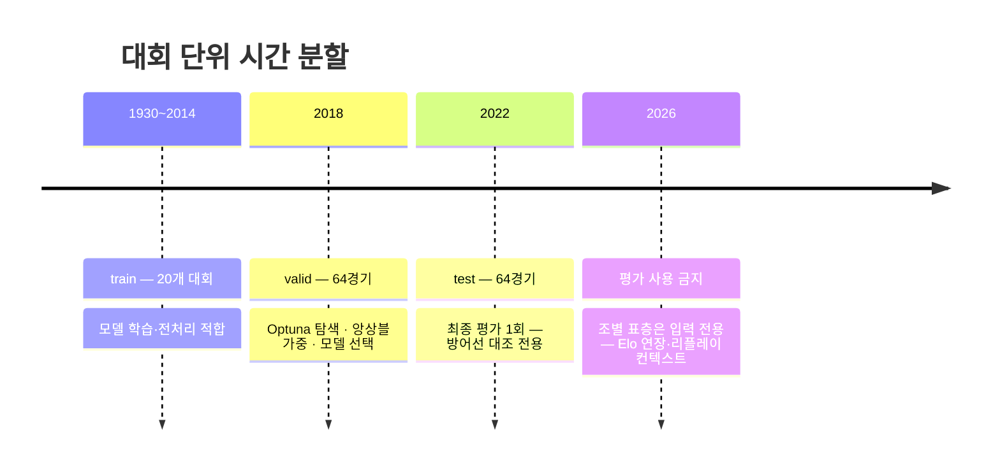

# 평가 설계 v1.0 — 방어선·지표·검증 분할·몬테카를로 수학적 연결

> [ML_설계_v1_0.md](ML_설계_v1_0.md) §2 평가 게이트의 분권. 검증 분할 결정은
> [ADR-007](../../decisions/ADR-007-검증분할.md), 수치 원천은 P12.
> 기획서 10절 "성능 방어선 표"와 F06·F07의 밴드·프레임 수학의 정본입니다.

---

## 1. 성능 방어선과 그 출처

| 지표 | 방어선 | 출처 (P12) |
|---|---|---|
| RPS | **0.19 ~ 0.22** | 국제대회 128경기 실측 baseline RPS 0.209~0.219 + 538 클럽 RPS 0.1957의 수렴 범위 |
| 정확도 | **0.50 ~ 0.55** | 동일 실측 0.508~0.547 |

- **인용 금지 명문화**: arXiv의 RPS 0.127(고급 모델)은 128경기 소표본 재적합 값으로 확인되어
  **벤치마크로 인용 금지**입니다 (P12 ⚠️). 이 문서·기획서·노트북 어디에서도 목표나 비교
  기준으로 쓰지 않습니다. 심사자 반박(T5)에 무너지는 수치를 처음부터 배제하는 것이 방어입니다.
- 방어선은 "이 정도면 공개 사례와 같은 수준"의 범위이지 우월 주장이 아닙니다. 기획서 서술은
  "공개 실측 범위와 정합"까지만 갑니다 (10절 금지·주의 "역추적 불가 수치 인용 금지" 준수).

## 2. 지표 정의

### 2.1 RPS (Ranked Probability Score) — 1차 지표

승/무/패는 순서가 있는 3범주입니다(승은 무보다 패에서 멀다). RPS는 누적 확률의 제곱 오차로
이 순서를 반영합니다:

```
RPS = 1/(r−1) · Σ_{i=1}^{r−1} ( Σ_{j≤i} (p_j − o_j) )²     (r = 3, o = 실제 결과 원핫)
    = ½ · [ (p_승 − o_승)² + ((p_승+p_무) − (o_승+o_무))² ]
```

낮을수록 좋습니다. "승 70%"로 예측하고 무승부가 나온 경우가, 패가 나온 경우보다 덜
벌점된다는 점이 정확도와의 결정적 차이입니다 — 확률 예측 서비스의 품질 지표로 RPS를
1차로 두는 이유이며, Optuna 목적함수도 RPS입니다 (ML_설계 §4.1).

### 2.2 정확도 — 보조 지표

argmax(p)와 실제 결과의 일치율. 직관적이라 기획서 서술에 병기하지만, 확률의 질을 보지
못하므로(51%와 99% 확신을 구분 못 함) 모델 선택에는 쓰지 않습니다.

### 2.3 캘리브레이션 — 신뢰도 다이어그램

예측 확률 구간(10-bin)별로 "예측 확률 vs 실제 발생 빈도"를 대조합니다. 준거는 공개 사례의
보정 진술 — "32% 확률이라 했으면 실제로 약 32%가 이겨야 한다" (538 여자WC, P12).
**IF 빈별 최대 편차가 0.10을 초과하면 THEN 보정(Platt/isotonic)을 추가**하고 valid로
재검증합니다 `[설계 결정: 임계 0.10]` (EV-R4).

### 2.4 두 모델의 정합 지표 (ADR-006 Consequences 관리)

분류 확률 p와 스코어 모델 λ 격자에서 유도한 확률 p_λ의 **총변동 거리
TV = ½·Σ|p_i − p_λ,i|** 를 valid 전 경기 평균으로 모니터링합니다.
임계 0.05 초과 시 λ 회귀에 캘리브레이션 항을 추가합니다 `[설계 결정]` (ML-R8과 연동).
이 지표가 관리되어야 조건부 2단 샘플링의 ② 단계(스코어)가 ① 단계(범주)와 자연스럽게
어울립니다.

## 3. 검증 분할 (ADR-007 상세)



**해설** — 방어선의 출처 실측이 2018+2022 out-of-sample 측정이므로, 같은 경기를 같은 방식으로
남겨두어야 "우리 수치 vs 방어선"이 같은 자의 비교가 됩니다 (ADR-007 Context). 2026 조별
3경기는 평가 표본이 아니라 **입력**입니다 — 이 경계를 넘으면 자기 서비스의 대상 경기로
자기를 평가하는 순환이 생깁니다.

**리키지 방지 체크리스트** (노트북 02장에서 기계 검증):

- [ ] Elo·form·exp_apps가 킥오프 이전 경기만 반영하는가 (경기별 타임스탬프 검사)
- [ ] 전처리 통계(스케일링 등)가 train에서만 fit되었는가
- [ ] valid·test 경기가 어떤 형태로든 학습 입력에 등장하지 않는가
- [ ] Optuna trial 이력에 test 지표가 한 번도 포함되지 않았는가

## 4. 몬테카를로의 수학적 연결 — 단일 추론에서 Wilson 밴드까지

이 절은 F06(5,000/25,000회)·F07(밴드·HOPs)의 수치가 **왜 그 값인지**를 수식으로 닫습니다.

### 4.1 연결 사슬

```
단일 추론 p = (p_승, p_무, p_패)          ← ONNX 앙상블 1회 (≤50ms 목표)
      │  조건부 2단 샘플링 (ADR-006)
      ▼
N회 반복: r_k ~ Cat(p), (x_k, y_k) ~ P(score | r_k)
      ▼
집계 p̂ = (#승/N, #무/N, #패/N) + 스코어 분포 + HOPs 프레임
      ▼
Wilson 밴드 (범주별) — 표시 (F07)
```

### 4.2 수렴 보장 — 왜 배열과 퍼센트가 어긋날 수 없는가

1단계에서 범주 지시변수 1{r_k = 승}은 Bernoulli(p_승)이므로 대수의 법칙에 의해
p̂_승 → p_승 (a.s.). 2단계(조건부 스코어)는 전확률 법칙
`P(score) = Σ_r P(r)·P(score|r)`에서 범주의 주변 분포를 건드리지 않습니다.
따라서 **MC 집계는 표시 확률 p로 수렴하며**, 잔차는 순수한 표본 오차 —
그 크기가 바로 다음의 SE입니다.

### 4.3 표본 오차와 반복 횟수 — 5,000/25,000의 수학적 자리

```
SE = √( p̂(1−p̂) / N )                        (P12 산식)

p̂=0.5 기준 (최악 케이스):
  N =  5,000 → SE ≈ 0.71%p → 95% 반폭 ≈ 1.39%p
  N = 25,000 → SE ≈ 0.32%p → 95% 반폭 ≈ 0.62%p
  ±1%p 95% 목표 → N ≥ 1.96²·0.25/0.0001 ≈ 9,604 → "N≥약 10,000" (P12 정합)
```

- **빠른 5,000회**: 반폭 ~1.4%p — 조작 반응용으로 충분한 정밀도, ≤1초 목표 (P5·P12)
- **정밀 25,000회**: 반폭 ~0.6%p — 공개 사례(Opta 25,000·538 클럽 20,000)와 정합 (P12)
- 밴드 폭 비는 √(25,000/5,000) = √5 ≈ 2.24배 — F06 수용 기준 "정밀 모드 밴드가 좁다"의
  정량 형태. QA에서 이 비율로 실측 검증 가능
- **자동 강등(F06-R7) 시**: N이 절반이 되면 밴드는 √2배 넓어집니다 — 넓어진 밴드를
  그대로 표시하는 것이 정직 고지이며, 좁게 보정하지 않습니다 (EV-R5)

### 4.4 Wilson score 밴드 (P12 채택)

```
center = ( p̂ + z²/2N ) / ( 1 + z²/N )
half   = z / ( 1 + z²/N ) · √( p̂(1−p̂)/N + z²/4N² )        (z = 1.96)
```

Wald(p̂ ± z·SE)와 달리 p̂이 0%·100%에 근접해도 구간이 항상 [0,1] 내부입니다 —
F07-R4("밴드가 [0,1]을 벗어나는 표시를 하지 않는다")의 수학적 근거이며, 순수 JS 즉시 계산으로
폴백 모드에서도 동작합니다 (P12·P4 정합).

### 4.5 HOPs 프레임 생성

- 각 프레임 = 몬테카를로 1회의 (r_k, x_k-y_k) — "이번 시뮬레이션에서는 2-1 승" (P12)
- 시뮬레이션 완료 후 표본에서 프레임 세트를 사전 추출(기본 20프레임 `[설계 결정]`) —
  재생(400ms/프레임, P12)은 추론과 분리된 사전 렌더 (F07-R2·P12 상호작용 흐름)

## 5. 보조 검증 (선택 항목, 비블로킹)

`goals.csv`의 득점 분 데이터(로컬 자체 검증 §3.1)로 **인매치 산식(ML_설계 §4.4)의 시점별
캘리브레이션**을 백테스트할 수 있습니다: 과거 경기의 각 득점 시점에서 "현재 스코어+잔여
시간"으로 최종 결과 확률을 계산하고 실제 결과와 신뢰도 대조. F12 타임라인 품질의 증거가
되지만, 방어선(프리매치)과는 별개 트랙이므로 **일정 압박 시 생략 가능**합니다 `[설계 결정]`.

## 6. 요구사항 (EARS)

| ID | 패턴 | 요구사항 |
|---|---|---|
| EV-R1 | WHEN | **WHEN** 학습이 완료되면, 시스템은 valid·test 지표(RPS·정확도·캘리브레이션)와 방어선 대조표를 노트북 09장에 산출한다 |
| EV-R2 | Ubiquitous | test(2022) 평가는 파이프라인 확정 후 1회만 수행한다 — 탐색·선택에 사용 금지 |
| EV-R3 | IF-THEN | **IF** test 평가 이후 모델·피처가 변경되면, **THEN** 재평가는 최종 확정 시점에 1회만 재허용하고 평가 이력 전체를 09장 보고서에 기록한다 |
| EV-R4 | IF-THEN | **IF** 캘리브레이션 빈별 최대 편차가 0.10을 초과하면, **THEN** 확률 보정을 추가하고 valid로 재검증한 뒤에만 진행한다 |
| EV-R5 | IF-THEN | **IF** 자동 강등(F06-R7)으로 N이 5,000 미만이 되면, **THEN** 넓어진 Wilson 밴드를 보정 없이 그대로 표시하고 반복 횟수를 병기한다 |
| EV-R6 | IF-THEN | **IF** 정합 지표 TV 평균이 0.05를 초과하면, **THEN** λ 회귀에 캘리브레이션 항을 추가해 재학습한다 (ML-R8 연동) |

## 7. 수용 기준 (Given-When-Then)

- **Given** 고정 시드·N=25,000 **When** MC 실행 **Then** |p̂ − p| ≤ 3·SE (범주별)
- **Given** 동일 상태 **When** N=5,000과 25,000 비교 **Then** 밴드 폭 비가 √5 ± 10%다
- **Given** p̂ > 0.99인 상태 **When** 밴드 계산 **Then** 상단이 1.0을 넘지 않는다 (Wilson·F07-R4)
- **Given** test 평가 완료 **Then** 보고서에 방어선 대조표와 측정 조건(2022 64경기, ADR-007)이 병기된다
- **Given** 신뢰도 다이어그램 **Then** 10-bin 전부의 편차가 표기되고 임계 초과 빈이 0개다

## 체크리스트

- [x] `[NEEDS CLARIFICATION]` 0건 ([설계 결정] 4건: 캘리브레이션 임계·TV 임계·HOPs 프레임 수·보조 검증 생략 가능)
- [x] IF-THEN ≥3 (EV-R3~R6, 4건)
- [x] GWT 전부 실측 가능 문장 (수치 기준 명시)
- [x] arXiv RPS 0.127 — 인용 금지 대상으로만 언급 (§1), 목표·비교 사용 0건
- [x] 5,000/25,000·Wilson·HOPs 400ms 전부 P12 역추적 / SE·수렴은 산식 유도
- [x] 실명·연상 표기 0건 / 비하 카피 0건
