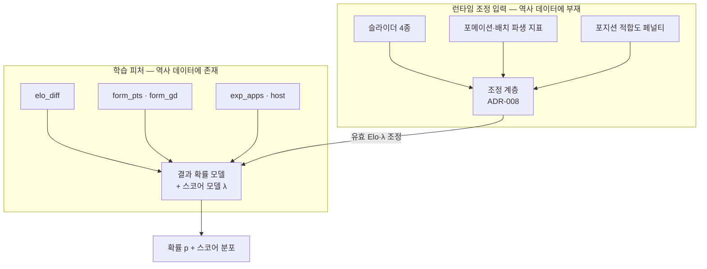

# 피처 정의서 v1.0 — 학습 피처 카탈로그와 슬라이더 4종 매핑

> [ML_설계_v1_0.md](ML_설계_v1_0.md) §3~§4의 분권. **ADR-002 Consequences 잔여 과제
> ("슬라이더의 모델 기여도 검증")의 해소 문서**이며, 결정 기록은 [ADR-008](../../decisions/ADR-008-슬라이더매핑.md).
> F04(슬라이더)·F01~F02(배치)가 모델 입력으로 변환되는 규칙의 정본입니다.

---

## 1. 피처 2계층 — 왜 나뉘는가



**해설** — 왼쪽(학습 피처)은 데이터셋에 값이 존재해서 **모델이 데이터로부터 효과를
학습**하는 입력입니다. 오른쪽(조정 입력)은 데이터셋에 컬럼 자체가 없어서(로컬 자체 검증,
[ML_설계 §3.1](ML_설계_v1_0.md)) 학습이 원천 불가능한 입력이며, **설계된 규칙(조정 계층)으로
학습 피처의 값을 변형**하는 방식으로만 모델에 도달합니다. 이 경계를 섞으면 "전술 효과를
데이터로 검증했다"는 허위 주장이 되므로, 문서·기획서 전체에서 이 2계층 구분을 유지합니다
(ADR-008 정직 고지).

## 2. 학습 피처 카탈로그

| id | 정의 | 산식·원천 | 리키지 방지 규칙 |
|---|---|---|---|
| `elo_diff` | 두 팀의 자체 산출 Elo 차이 | §3 · `matches` | 킥오프 이전 경기만 반영 (rolling) |
| `form_pts` | 직전 5경기 평균 승점 (양 팀 각각) `[설계 결정: 창 5]` | `team_appearances` W=3/D=1/L=0 | 대회 경계를 넘어 직전 5경기 — 이전 대회 포함 |
| `form_gd` | 직전 5경기 평균 골득실 | `team_appearances` goal_differential | 동일 |
| `exp_apps` | 해당 대회 이전까지의 본선 출전 대회 수 | `tournaments`·`team_appearances` | 당 대회 제외 |
| `host` | 개최국 여부 (0/1) | `tournaments.host_country` | 사전 확정 정보 — 리키지 없음 |
| `stage_ko` | 토너먼트 스테이지 여부 (0/1) | `matches.knockout_stage` | 사전 확정 정보 |

- **라벨 = 정규 90분 기준 승/무/패** `[설계 결정]` — `matches`의 extra_time·penalty_shootout
  플래그가 참이면 90분 결과는 무승부로 계상합니다. 서비스의 예측 대상(조별리그 컨텍스트,
  기본 상대 체코전)은 무승부가 유효한 결과이므로, 연장·승부차기로 라벨을 오염시키지 않습니다.
- **선수 단위 피처는 학습에 넣지 않습니다** — 팀 수준만. 실명 불요 경계(ML_설계 §3.3 ①)를
  지키는 동시에, 소표본에서 피처 폭증은 과적합 주범이기 때문입니다 (P3 §5).
- 피처 수를 한 자릿수로 유지하는 것 자체가 설계입니다: 학습 표본이 남자 WC 22개 대회
  (로컬 자체 검증) 규모이므로, "피처를 늘려 성능을 쥐어짜는" 방향은 P3의 과적합 경고와
  정면 충돌합니다. 부족하면 §5의 방침대로 줄이는 쪽으로 움직입니다.

## 3. Elo 산출 명세 — 자체 계산 (외부 레이팅 미사용)

### 3.1 왜 자체 계산인가

eloratings.net 등 외부 공개 지수는 이용 약관·재배포 조건이 불명확해 실격 리스크 관리
원칙(P10 계열)과 충돌합니다. 데이터셋의 경기 결과만으로 Elo를 자체 산출하면 **라이선스가
전적으로 자기 통제** 하에 있고(P9의 직접 학습 채택과 같은 논리), 산식·계수까지 문서로
공개할 수 있어 재현성·신뢰도 서술에도 유리합니다.

### 3.2 산식

```
E_A = 1 / (1 + 10^(−(R_A − R_B)/400))      // 기대 승점율 (Elo 표준 정의)
S_A = 1 (승) | 0.5 (무) | 0 (패)            // 90분 기준 실제 결과
R_A ← R_A + K · (S_A − E_A)                 // 경기 후 갱신
```

- 초기값 전 팀 1500 `[설계 결정]`
- **K는 고정하지 않고 Optuna 탐색 범위 [20, 60]의 하이퍼파라미터로 취급** `[설계 결정]` —
  국제경기 Elo의 K 관행이 출처마다 달라 단일 값을 인용할 근거가 없으므로, valid RPS를
  기준으로 데이터가 고르게 합니다. 골득실 마진 가중은 실험 항목(개선 시만 채택)
- **대회 간 공백 감쇠**: 대회 시작 시점에 `R ← 1500 + φ^g · (R − 1500)` 적용.
  g = 직전 출전 이후 건너뛴 대회 수+1, φ ∈ [0.7, 1.0] Optuna 탐색 `[설계 결정]` —
  오래 결장한 팀일수록 과거 레이팅의 증거력이 약하므로 평균으로 회귀시킵니다

### 3.3 2026 입력 연장과 한계 고지

- 기본 4팀(kor·cze·mex·rsa)의 서비스 입력 레이팅은 **2026 대회 직전 값**입니다 — 조별리그
  결과를 미리 반영하면 "경기 전에 확률을 탐색한다"는 서비스 관점(F11 "다른 선택지")과
  어긋납니다. 리키지 방지 원칙(ML-R2)의 런타임 버전입니다.
- 2022 이후 공백은 openfootball 2026 표층(퍼블릭 도메인, P2)의 조편성·결과로 대회 직전
  시점까지 연장 검증하되, **IF 표층 데이터가 결측·불일치면 THEN 2022 기준 레이팅+감쇠를
  사용하고 문서에 고지**합니다 (ML_설계 §7.2와 동일 경로).
- **한계 정직 고지**: 본선 데이터만 쓰므로 장기 본선 공백 팀의 레이팅 증거는 약합니다.
  체코가 대표 사례입니다 — 감쇠 규칙이 이를 평균 방향으로 보정하지만, 이 불확실성 자체를
  기획서 10절 한계 절에 명기합니다. 숨기지 않는 것이 방어입니다 (P3 정합: "표본 부족을
  숨기지 않고 먼저 밝힌다").

## 4. 슬라이더 4종 → 모델 입력 매핑 (ADR-008 상세)

### 4.1 공통 규약

- 슬라이더 값 s ∈ [0,100] → 중심화 **z = (s − 50) / 50 ∈ [−1, +1]**. 중앙값(기본 상태,
  ADR-004)에서 z=0이므로 **조정 계층은 기본 상태에서 항등**입니다 — 첫 화면의 확률은
  순수하게 학습 모델의 출력입니다.
- 조정은 스코어 모델의 λ 쌍에 곱셈 항 `exp(·)`로 가해지고, 결과 확률 모델에는 λ 변화를
  Elo 등가점으로 번역해 전달합니다:
  `Δ_eff = elo_diff + c · 400 · log₁₀( (λ_kor/λ_opp) / (λ⁰_kor/λ⁰_opp) )` — 조정 메커니즘이
  하나(λ)이고 분류기는 그 번역본을 받는 구조라 두 모델이 같은 전술 신호를 봅니다.
  c는 민감도 분석으로 캘리브레이션 `[설계 결정]`
- **양날 원칙**: 모든 슬라이더는 이득 항(z 비례)과 리스크 항(z² 비례)을 함께 가집니다.
  극단값일수록 리스크가 비선형으로 커져 "전부 최대 = 필승"이 구조적으로 불가능합니다 (ADR-008)

### 4.2 슬라이더별 매핑표

| 슬라이더 | 이득 항 | 리스크 항 | 축구 담론 근거 |
|---|---|---|---|
| **라인 높이** z_L | λ_kor ← ·exp(δ_L·z_L) — 전진 압축, 공격 지원 | λ_opp ← ·exp(κ_L·z_L²)·exp(δ_L'·max(z_L,0)) — 뒷공간 노출(높을 때), 극단 리스크 | 하이라인의 공수 트레이드오프는 통용 담론 `[설계 결정: 방향]` |
| **압박 강도** z_P | λ_opp ← ·exp(−δ_P·z_P) — 상대 빌드업 저해 · λ_kor ← ·exp(δ_P''·z_P) — 높은 회수 위치 | λ_opp ← ·exp(κ_P·z_P²) — 체력 소모·압박 통과 시 실점 위험 | 압박 강도와 공격 성과의 상관은 P3 수록 연구 계열(PPDA↔xG) — 단 상관 수준임을 유지 (P3) |
| **공격 폭** z_W | λ_kor ← ·exp(δ_W·z_W) — 측면 공간 활용 | λ_kor ← ·exp(−κ_W·z_W²) — 극단(과도한 폭·과도한 압축)은 공격 단조화 | ADR-002 선정 기준 ①(감독 용어) 연장 `[설계 결정: 방향]` |
| **템포** z_T | λ_kor·λ_opp ← 양쪽 ·exp(δ_T·z_T) — 빠른 템포는 양 팀 모두 기회 수 증가 | 열린 경기 = 분산 증가 그 자체가 리스크 (강팀 상대 시 불리) | 템포는 "경기의 열림"을 조절 — 확률보다 **분포의 분산**을 움직이는 유일한 슬라이더 `[설계 결정]` |

**해설 — 템포가 특별한 이유**: 템포는 λ 비율(누가 유리한가)이 아니라 λ 합(얼마나 많은 일이
일어나는가)을 움직입니다. 열세일 때 템포를 올리면 이길 확률과 대패 확률이 함께 커집니다 —
"지고 있을 때 오픈 게임으로 승부수"라는 감독 경험이 수학적으로 재현되며, 이것이 F11 개입
시나리오의 서사적 재미를 만드는 장치입니다.

### 4.3 포메이션·배치 파생 지표 — 이중 계상 방지

배치 자체도 라인 높이·폭 정보를 담고 있으므로(DF 평균 y = 라인, x 표준편차 = 폭), 슬라이더와
그대로 합산하면 같은 의도가 두 번 계상됩니다. **가중 결합으로 단일화**합니다 `[설계 결정]`:

```
z_line  = ½·z_slider_line + ½·z_pos_line     // z_pos_line: DF 평균 y를 프리셋 기준 대비 정규화
z_width = ½·z_slider_width + ½·z_pos_width   // z_pos_width: 필드 플레이어 x 표준편차 정규화
```

결합된 z가 §4.2의 매핑에 들어갑니다. 압박·템포는 배치에서 유도되지 않으므로 슬라이더 단독입니다.

### 4.4 포지션 적합도 페널티 (M4 휴리스틱, P3 [추정] 유지)

포메이션 상성·포지션 이탈을 승패와 직접 연결한 재현 가능 연구는 부재가 확인되었으므로(P3),
자체 휴리스틱으로 설계하고 **[추정]을 유지**합니다:

```
penalty_att = ρ · Σ dist(pos_i, role_i)   for i ∈ FW·MF 슬롯   → λ_kor ← ·exp(−penalty_att)
penalty_def = ρ · Σ dist(pos_i, role_i)   for i ∈ DF·GK 슬롯   → λ_opp ← ·exp(+penalty_def)
dist: 포지션 사슬 GK–DF–MF–FW 상의 거리 (GK↔FW = 3, 인접 = 1)
```

- 공격진의 이탈은 자기 득점 기대를 깎고, 수비진의 이탈은 상대 득점 기대를 올립니다 —
  이탈의 성격에 따라 효과의 방향이 갈리는 것이 축구 직관과 정합
- GK 슬롯에 필드 플레이어 배치는 dist=3 최대 페널티 — 단 확률은 항상 (0,1) 내부에서 표시
  유지 (빈 패널·에러 금지, F05 계열 원칙)

### 4.5 효과 상한과 민감도 캘리브레이션

- **총 조정 상한**: 슬라이더·배치·페널티를 모두 합산한 λ 변화는 기준 대비 **±30% 이내로
  정규화** `[설계 결정: 초기값, 민감도 분석으로 재캘리브레이션]`
- **단일 슬라이더 민감도 목표**: 1종 최대 조작 시 승리 확률 변화 목표 밴드 ±3~8%p
  `[설계 결정: 초기값]` — 너무 작으면 조작감 상실(P5 100ms 반응의 의미 소멸), 너무 크면
  모델이 아니라 슬라이더가 승부를 결정(정직성 훼손)
- 캘리브레이션 절차: 노트북 09장에서 슬라이더 전 구간 그리드 × 몬테카를로로 민감도 곡선을
  산출하고, δ·κ·ρ·c를 목표 밴드에 맞게 조정. **조정 결과 수치는 이 문서 v1.1에 기록**

## 5. 기여도가 낮을 때의 처리 방침 (ADR-002 잔여 과제의 답)

| 단계 | 조건 | 조치 |
|---|---|---|
| ① 프록시 검증 | 데이터셋에서 유도 가능한 전술 프록시 발견 시 | valid RPS 개선을 조건으로 학습 피처 채택 |
| ② 조정 계층 확정 | 프록시 부재·기여 미미 (**현재 확인된 상태** — 전술 컬럼 부재) | §4의 조정 계층이 확정 경로 |
| ③ 정직 고지 | 항상 | 효과 상한·근거 태그 문서화 + 기획서에 "학습된 팀 강도 + 설계된 전술 반응"의 이원 구조 명시 |

**해설** — ADR-002가 남긴 질문("공격 폭·템포의 기여도가 낮으면?")의 답은 "기여도를 측정할
데이터 자체가 없음이 확인됐고(①의 전제 붕괴), 따라서 ②가 기본 경로이며, 정직성은 ③이
보장한다"입니다. 슬라이더 4종은 전부 동일하게 조정 계층을 통하므로 **4종 사이에 차별이
없고**, F04 수용 기준("4종 각각 조작 시 확률이 변한다")은 §4.2 매핑으로 4종 모두 충족됩니다.

## 6. 요구사항 (EARS)

| ID | 패턴 | 요구사항 |
|---|---|---|
| FT-R1 | Ubiquitous | 모든 학습 피처는 해당 경기 킥오프 이전 정보만으로 계산된다 (ML-R2 상속) |
| FT-R2 | WHEN | **WHEN** 전술 상태가 커밋되면, 조정 계층은 결합(§4.3) → 페널티(§4.4) → 상한 정규화(§4.5) → λ·Δ_eff 산출 순으로 적용된다 |
| FT-R3 | Ubiquitous | 기본 상태(슬라이더 중앙값 + 프리셋 기준 배치)에서 조정 계층은 항등이다 |
| FT-R4 | IF-THEN | **IF** 조정 후 λ가 상한(팀당 4.5 `[설계 결정]`)을 초과하면, **THEN** 시스템은 λ를 상한으로 클램프하고 스코어 격자 0~6골 범위를 유지한다 |
| FT-R5 | IF-THEN | **IF** 민감도 분석에서 단일 슬라이더 효과가 목표 밴드를 벗어나면, **THEN** δ·κ 계수를 재캘리브레이션하고 통과 전 배포하지 않는다 (파이프라인 게이트) |
| FT-R6 | IF-THEN | **IF** GK 슬롯에 비GK 선수가 배치되면, **THEN** 최대 페널티(dist=3)를 적용하되 확률 표시는 (0,1) 내부에서 정상 유지한다 |
| FT-R7 | IF-THEN | **IF** Elo 산출 시 대회 간 공백 g ≥ 2이면, **THEN** 감쇠 φ^g를 적용하고 노트북 02장에 공백 팀 목록을 기록한다 |

## 7. 수용 기준 (Given-When-Then)

- **Given** 기본 상태 **When** 조정 계층 적용 **Then** λ·Δ_eff가 무조정 값과 일치한다 (항등 검증)
- **Given** 슬라이더 1종 최대 조작 **When** 민감도 측정 **Then** 승리 확률 변화가 목표 밴드(±3~8%p) 이내다
- **Given** 4종 슬라이더 각각 **When** 단독 조작 **Then** 각각 확률 변화가 관찰된다 (F04 GWT 상속)
- **Given** 전 슬라이더 100 **When** 몬테카를로 비교 **Then** 중앙값 상태 대비 승리 확률이 일방적으로 우위가 아니다 (양날 원칙 — 퇴화 전략 차단 검증)
- **Given** Python·JS 양쪽 조정 계층 **When** 동일 케이스 대조 **Then** 산출 λ·Δ_eff가 오차 1e-9 이내로 일치한다 (이중 구현 정합)

## 체크리스트

- [x] `[NEEDS CLARIFICATION]` 0건 ([설계 결정] 다수 — 계수 초기값은 민감도 분석 후 v1.1 기록 예약)
- [x] IF-THEN ≥3 (FT-R4~R7, 4건)
- [x] GWT 전부 실측 가능 문장
- [x] ADR-002 잔여 과제 해소 명시 (§5)
- [x] 학습/조정 2계층 경계 유지 — "전술 효과를 학습했다" 서술 0건
- [x] 실명·연상 표기 0건 / 비하 카피 0건 / P3 [추정] 태그 유지 (§4.4)
