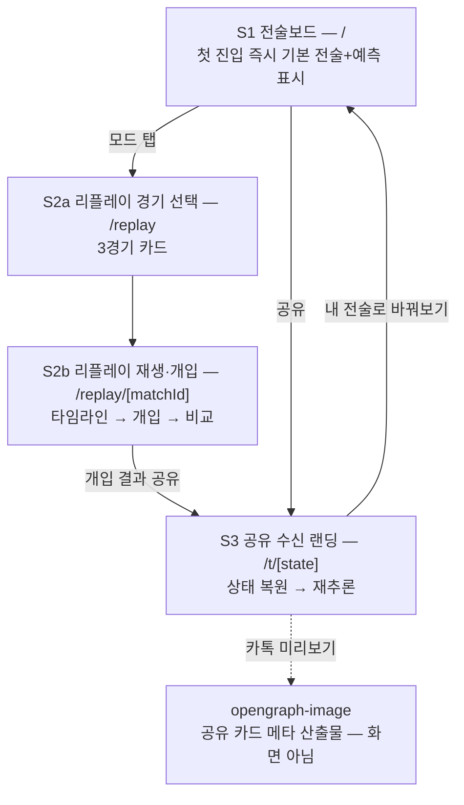

# 7. 페이지 구성과 와이어프레임 [대회 필수③]

> 분량 목표: 2p · 방어: 감동 경험 25 · 기획/구현 일관성 20 · 근거: P5

---

**핵심 메시지 — 3페이지로 충분하다: 전술보드 / 리플레이 / 공유 랜딩.**

페이지 수를 늘리지 않은 것 자체가 설계다. 심사자는 이동 없이 한 화면에서 핵심 경험(조작→
예측)을 완결하고, 리플레이와 공유 랜딩만 별도 경로를 가진다. 전 화면 **Mobile First** —
심사자가 모바일로 열 것을 전제로 모바일 레이아웃이 기준 설계다.

## 정보 구조 (IA)

**읽는 법** — 화살표가 곧 사용자의 이동 경로다. S3→S1 화살표(수신자가 보낸 이의 전술을
이어받아 조작 시작)가 공유 루프의 핵심 연결이며, 12절의 바이럴 설계와 1:1로 대응한다.

## 화면별 역할과 레이아웃

### S1 — 전술보드 (메인, `/`)

모바일 기준: 상단 헤더(서비스명·모드 탭) → **피치(자체 SVG, 세로 방향)** → 하단 고정
**예측 패널**(승/무/패 배열+밴드) → 스와이프로 여는 **슬라이더 시트**(4종).
데스크톱은 피치 좌 2/3 + 우측 패널(슬라이더 상단·예측 하단).

- 첫 진입: 4-3-3 + 슬라이더 중앙값으로 예측치가 **이미 표시된 상태** (P5 — 빈 화면 금지)
- 선수 토큰: **가공명 성(姓) 1음절 + 포지션 색상 링**(GK/DF/MF/FW 4색), 탭 시 전체 가공명
  툴팁 — 터치 타겟 1cm 안에서 가독과 접근성(색+텍스트 이중 부호화)을 동시 확보 (P5·P7)
- 터치 타겟 ≥1cm, 드래그 피드백은 손가락 위 오프셋 표시 (P5)

### S2a — 리플레이 경기 선택 (`/replay`)

3경기 카드(모바일 세로 스택 / 데스크톱 3열): 상대 국기 + 라운드 + 개최지 + 스코어 —
전부 확정 데이터만 (P11). 카드 진입 카피는 "이 경기, 당신이라면?" 톤으로 통일한다.

### S2b — 리플레이 재생·개입 (`/replay/[matchId]`)

경기 헤더(스코어·개최지) → **승률 라인차트**(실제 라인, 개입 시 시나리오 점선 병렬) →
**이벤트 타임라인**(확정 분 단위, P11) → "이 시점에 개입하기" 버튼.
개입 시 전술보드가 오버레이로 열린다 — **S1과 같은 컴포넌트의 재사용**이라 조작법을 다시
배울 필요가 없고, 구현 코드 경로도 하나다(완성도 리스크 절반). xG 표기부에는 "Opta xG"
출처 라벨을 상시 병기한다 (P11).

### S3 — 공유 수신 랜딩 (`/t/[state]`)

URL에 인코딩된 전술 상태를 복원해 보낸 사람의 전술 카드를 렌더하고, **수신자의 브라우저에서
자동 재추론**한다 (P8 — 서버 저장 없음). 화면 하단의 "내 전술로 바꿔보기" 버튼 하나로
상태를 이어받은 채 S1에 진입한다 — 수신자가 1탭으로 조작 경험에 도달하는 것이 이 화면의
존재 이유다.

## 전 화면 공통 상태 규칙

| 상태 | 처리 | 근거 |
|---|---|---|
| 초기 로딩 | 기본값 화면 우선 표시 — 모델은 뒤에서 로드 | P4·P5 |
| 추론 중 | 직전 결과 유지 + 갱신 인디케이터 (화면을 비우지 않음) | P5 |
| 정밀 시뮬레이션 | 진행률 + 취소 버튼 (10초 임계) | P5·P12 |
| 추론 엔진 실패 | 순수 JS 통계 폴백 + "간이 추정" 배지 — 패널 유지 | P4·P12 |
| 빈 상태 | **설계상 존재하지 않음** — 전 화면이 기본값으로 채워져 시작 | P5 |

`[조판: ① IA 다이어그램(위 mermaid 렌더) ② 화면 와이어프레임 4종 — S1 모바일(기준)·S1 데스크톱·
S2b·S3. 화면흐름 v1.0의 레이아웃 구조를 그대로 시각화하되 선수 토큰은 가공명 1음절+색상 링으로
표기(실명 절대 금지). 캡션 각각 "S1 전술보드 — 첫 진입부터 완성 상태" 등]`

---

## 검수 메모 (조판 제외)

- [x] 골격 카드 확정 사항 소화: IA+페이지별 와이어프레임 ○ / Mobile First ○ / 공유 수신 랜딩 즉시 렌더 ○
- [x] 금지·주의: 와이어프레임 내 선수명 = 가공명 — 조판 지시에 "실명 절대 금지" 명기 (P7)
- [x] 화면·기능 대응이 화면흐름 v1.0(S1~S3)과 일치 — 11절 흐름과 1:1 연결 가능
- [x] 실명·비하 0건 · 분량 2p 내
