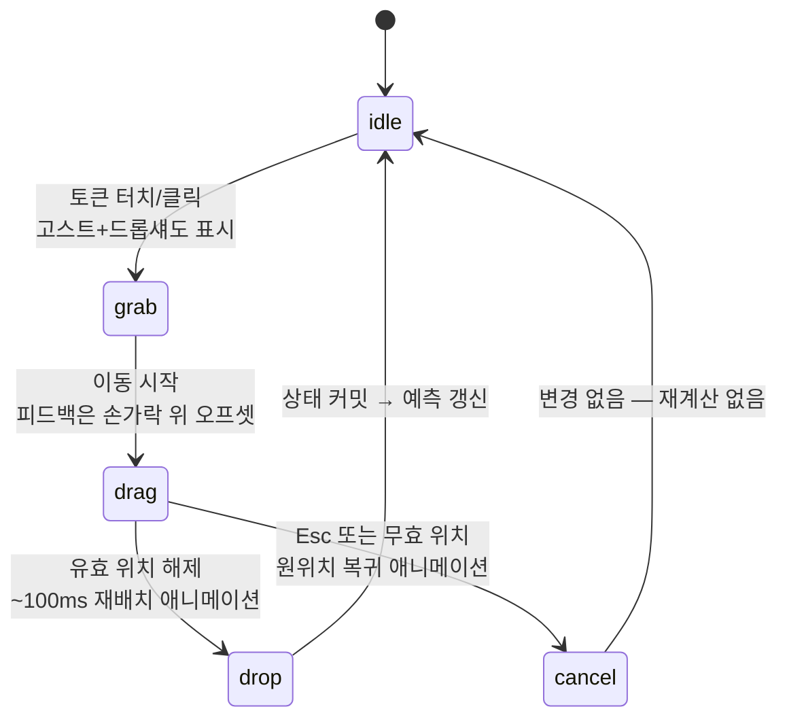

# 8. 핵심 인터랙션 명세 [대회 필수④]

> 분량 목표: 1.5p · 방어: 감동 경험 25 · **완성도 25** · 근거: P5·P12

---

**핵심 메시지 — 인터랙션마다 상태 전이·접근성 대안·지연 예산을 명세해 "확실히 작동"을
설계로 보증한다.**

"동적 인터랙션이 실제로 작동하지 않으면 해당 기능은 평가에서 제외"되므로, 이 절에 명세한
것은 전부 구현 대상이며, 구현이 불확실한 것은 처음부터 명세에 넣지 않았다.

## 1. 드래그앤드롭 — 상태 전이 명세

각 상태의 시각 피드백(커서 변화 → 고스트 → 스냅 하이라이트 → 재배치 애니메이션)은 NN/g
검증 패턴을 따르고 (P5), 드롭존은 시각 경계보다 넓게 잡아(스냅 마그네티즘) 모바일 오조작을
흡수한다.

## 2. 접근성 — 드래그의 대안 경로는 독립 요건이다

- **클릭-클릭 대안** (WCAG 2.5.7 Dragging Movements, AA): 토큰 탭 → 목적지 탭의 2탭 이동을
  모든 드래그와 동등하게 제공 (P5)
- **키보드 경로**: Tab(토큰 순회) → Space(집기) → 방향키(이동) → Enter(놓기) → Esc(취소).
  2.5.7과 별개의 독립 요건으로 구현 (P5)
- 모바일 터치 타겟 1cm×1cm, 드래그 피드백은 손가락에 가리지 않게 오프셋 (P5)

## 3. 슬라이더 — 프리뷰와 계산의 분리

슬라이더 값 변경 → **100ms 내 시각 프리뷰**(라인 가이드·압박 음영·산개 폭·화살표 밀도) →
조작 종료(debounce) 후 시뮬레이션 자동 실행. 계산 중 재조작하면 진행 중 계산을 **취소하고
최신 값으로 재시작**한다 — 옛 결과가 나중에 도착해 최신 화면을 덮어쓰는 경쟁 상태를
설계 단계에서 차단한다.

## 4. 지연 예산표 — 성능을 약속의 형태로

| 인터랙션 | 예산 | 초과 시 처리 | 근거 |
|---|---|---|---|
| 슬라이더 → 시각 프리뷰 | ≤100ms | 프리뷰 효과 단계 축소(음영→선), 값 반영은 유지 | P5 |
| 드래그 재배치 애니메이션 | ~100ms | — | P5 |
| 단일 추론 (Web Worker) | ≤50ms [설계 목표] | — | P4 |
| 빠른 시뮬레이션 5,000회 | ≤1초 목표 | 스피너 + 반복 수 자동 강등(정직 표기) | P5·P12 |
| 정밀 시뮬레이션 25,000회 | ≤10초 | **진행률 바 + 취소 버튼 필수** | P5·P12 |
| 초기 로딩 (모델 포함) | ≤3초 [설계 목표] | 기본값 화면 우선 표시 | P4 |

[설계 목표] 표기 항목은 구현 후 실기기 계측으로 검증한다(15절 로드맵의 명시 단계).

## 5. 확률 표기 — 단일 수치 단독 금지

확률은 항상 3중으로 병기한다 (P12):

1. **10×10 아이콘 배열** — "100번 중 62번"을 상단부터 채움(중앙·무작위 편향 배치 회피),
   스크린리더에는 "승리 확률 62%, 100번 중 62번" 텍스트 라벨
2. **퍼센트 숫자** — 그래픽 단독 표시 금지
3. **Wilson 신뢰구간 밴드** — 확률이 0%·100%에 근접해도 구간이 [0,1]을 벗어나지 않는
   Wilson score 방식. 순수 JS로 즉시 계산되어 폴백 모드에서도 동작 (P12)

여러 시나리오를 대조할 때는 **HOPs 애니메이션 옵션**(400ms/프레임, 각 프레임 = 시뮬레이션
1회 결과)을 제공하되 (P12), OS의 동작 축소 설정(prefers-reduced-motion)을 존중해 자동
재생을 끈다. 시뮬레이션 결과에는 반복 횟수("5,000회 시뮬레이션")를 항상 명기한다 — 정직
고지가 곧 신뢰의 인터페이스다.

`[조판: ① 상태 전이도(위 mermaid 렌더) ② 지연 예산표(위 표 그대로) ③ 확률 3중 표기
목업 — 아이콘 배열 62칸 채움 + "62%" + 밴드를 한 패널로. 캡션 "같은 확률의 세 가지 얼굴 (P12)"]`

---

## 검수 메모 (조판 제외)

- [x] 골격 카드 확정 사항 소화: D&D 상태 전이 ○ / WCAG 2.5.7+키보드 독립 요건 ○ / 1cm·오프셋 ○ / 지연 예산표 ○ / 3중 표기+HOPs+Wilson ○
- [x] 금지·주의: 구현 불확실 항목 없음 — 전부 검증된 패턴(P5)과 순수 계산(P12)
- [x] [설계 목표] 2건은 15절 실측 단계와 연결 · 실명·비하 0건 · 분량 1.5p 내
