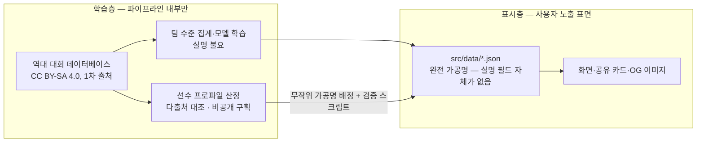

# 9. 데이터 활용 방식 [대회 필수⑤]

> 분량 목표: 1p · 방어: 완성도 25 + **실격 방어** · 근거: P2·P10·P6·P11

---

**핵심 메시지 — 2계층 데이터 전략: 학습은 실데이터로 정확하게, 노출은 가공명으로 안전하게.**

## 계층 구조 — 실명이 흐르는 경계를 스키마로 막는다

**학습층**: 학술 공개 데이터셋 `joshfjelstul/world-cup-database`(CC BY-SA 4.0, 원저작자
1차 출처)를 채택했다 (P2·P10). 실선수명은 **모델 학습·집계 파이프라인 내부까지만** 사용한다.
채택 과정에서 HF의 StatsBomb 재업로드 2건은 카드 표기(CC BY-SA)와 원 계약(비상업·재배포
금지)의 문구 단위 불일치가 확정되어 **사용을 금지**했다 (P10) — 라이선스 표기는 재업로드로
세탁되지 않는다.

**표시층**: 화면·공유 이미지·클라이언트 JSON에는 **완전 가공명**만 도달한다. 선수 능력
프로파일은 단일 소스 복제가 아니라 **여러 독립 출처를 대조해 직접 산정**한다 — 단일 상업
DB의 체계적 추출은 데이터베이스권 리스크이기 때문이다 (P10). 데이터는 처음부터 정적
JSON(`src/data/*.json` + TypeScript 타입)으로 구성하며, 이는 주최 측의 "더미 데이터 직접
구성·JSON 권장" 안내와 정합한다. **JSON 스키마에 실명 필드 자체가 없어** 실수로도 실명이
화면에 도달할 수 없고, 빌드 검증 스크립트가 참조 무결성·실명 유사도·타입을 검사한다.

## 리플레이 데이터 — 확정값만 쓴다

리플레이 3경기의 모든 표시는 교차 검증된 확정값만 사용한다 (P6·P11):

| 경기 | 개최지 | 결과 | 타임라인 예시 |
|---|---|---|---|
| 체코전 | Estadio Akron (과달라하라) | **2-1 승** | 59' 실점 → 67'·80' 득점 |
| 멕시코전 | Estadio Akron (과달라하라) | 0-1 | 후반 초반 실점 |
| 남아공전 | Estadio BBVA (몬테레이) | 0-1 | 63' 실점 · 46' 교체 투입 |

- 득점·교체의 분(分)은 공식 리포트 재대조로 확정된 값만 싣는다 (P11). 재대조가 끝나지 않은
  항목(예: 경고 세부)은 데이터에 **행 자체를 만들지 않는다** — "확정 안 된 것은 표시하지
  않는다"가 데이터 수준에서 보장된다
- xG는 서로 다른 산출 모델이 존재하므로 항상 출처 라벨과 병기한다 — 남아공전 1.16/0.90은
  "Opta xG" 라벨 필수 (P11)
- 46' 교체 투입 등 기용 관련 항목은 **사실만 기록**하고 평가하지 않는다 (비하 금지 원칙)

## 라이선스 고지

데이터셋 기반 산출물(집계 통계·모델)은 CC BY-SA 4.0의 동일조건변경허락 조항에 따라
저장소에 **분리 고지 문서**를 두어 코드 라이선스와 구분한다 (P10). 상세는 13절.

`[조판: 2계층 흐름도(위 mermaid 렌더) — 학습층/표시층 경계선을 굵은 점선+자물쇠 아이콘으로
강조. 캡션 "실명은 경계를 넘지 못한다 — 스키마가 막는다 (P7·P10)"]`

---

## 검수 메모 (조판 제외)

- [x] 골격 카드 확정 사항 소화: 학습층 joshfjelstul ○ / StatsBomb 재업로드 금지 ○ / 표시층 가공명·다출처·JSON ○ / 리플레이 확정값·개최지·Opta 라벨 ○ / CC BY-SA 분리 고지 ○
- [x] 금지·주의: 분(分)은 P11 확정값만 / 46' 교체는 사실 서술만 — 평가 어휘 0건
- [x] **선수 실명 0건** (멕시코전 실점은 "후반 초반"으로 서술 — 상대 선수 실명 회피) · 분량 1p 내
