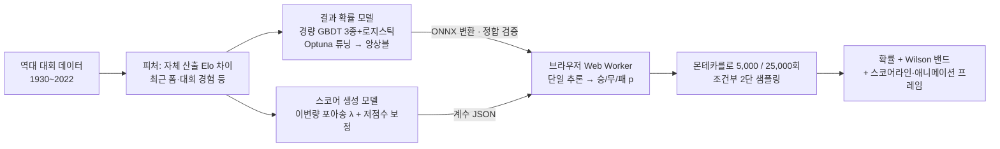

# 10. ML/DL 아키텍처

> 분량 목표: 1.5p · 방어: **참신성 30 · 완성도 25** + 1차 투표 기술 인정 · 근거: P3·P4·P9·P12

---

**핵심 메시지 — 직접 학습한 경량 모델을 심사자의 브라우저에서 돌린다. 서버도, API 키도 없이.**

## 노선 — 왜 "직접 학습 + 온디바이스"인가

사전학습 모델 파인튜닝 노선은 검토 후 기각했다. 축구 결과 예측의 공개 모델 생태계는 독립
검증이 없는 얕은 층이고, 무엇보다 **라이선스는 파인튜닝으로 세탁되지 않는다** — 비상업
조건의 베이스 모델은 파생물에 조건이 그대로 승계된다 (P9). 직접 학습한 경량 모델은
라이선스를 전적으로 스스로 통제하며, ONNX로 변환해 브라우저에서 확실히 돈다 (P3·P4·P9).

추론은 ONNX Runtime Web의 **wasm 전용 서브셋**(로더 약 47KB)으로 사용자 기기에서 실행한다
(P4). 외부 API 호출이 0건이므로 "심사자가 별도 키 없이 확인"이라는 심사 조건이 기능이
아니라 **구조로** 충족되고, 심사 중 외부 장애 지점도 없다. 심사자는 개발자 도구의 네트워크
탭만 열어도 이를 검증할 수 있다.

## 아키텍처 — 두 개의 모델, 하나의 확률

- **결과 확률 모델**: Elo 차이를 핵심 공변량으로 하는 로지스틱 기준선(공개 실측에서 검증된
  계열, P12) 위에 경량 GBDT 3종을 학습·튜닝해 앙상블한다. 팀 강도(Elo)는 외부 지수를 쓰지
  않고 **데이터셋의 경기 결과만으로 자체 산출**한다 — 산식까지 공개 가능한 자기 통제
  라이선스 (P3 계열)
- **스코어 생성 모델**: 이변량 포아송 + 저점수 보정(Dixon-Coles τ) 계열로 기대득점을 추정
  (P12). 몬테카를로의 각 반복은 "결과 범주 → 그 범주와 일치하는 스코어" 순서의 **조건부
  2단 샘플링**이라, 시뮬레이션 집계가 화면의 단일 추론 확률과 수학적으로 일치한다 —
  "숫자 따로, 그림 따로"가 원리상 불가능한 구조다
- **전술 반응의 정직한 이원 구조**: 역사 데이터에는 전술 성향(라인·압박 등) 기록이 없다.
  따라서 슬라이더·배치는 학습된 효과가 아니라 **축구 도메인 지식으로 설계한 조정 규칙**으로
  모델 입력(팀 강도·기대득점)을 유계 범위에서 변형한다. 모든 슬라이더는 이득과 리스크를
  함께 갖는 양날 설계라 "전부 최대 = 필승"이 성립하지 않는다. 이 구분 — **학습한 팀 강도
  모델 + 설계한 전술 반응 규칙** — 을 숨기지 않고 명시하는 것이 이 아키텍처의 정직성이다

## 성능 방어선 — 공개 실측과 같은 자로 잰다

| 지표 | 방어선 | 출처 (P12) |
|---|---|---|
| RPS (낮을수록 좋음) | **0.19 ~ 0.22** | 국제대회 128경기 공개 실측 0.209~0.219와 상용 예측(클럽 RPS 0.1957)의 수렴 범위 |
| 정확도 | **0.50 ~ 0.55** | 동일 실측 0.508~0.547 |

검증은 대회 단위 시간 분할(과거 대회 학습 → 2018 검증 → 2022 최종 평가 1회)로, 방어선
출처와 **같은 측정 조건**을 유지한다. 시뮬레이션은 빠른 5,000회(±1.4%p 수준)와 정밀
25,000회(±0.6%p 수준)의 2모드 — 상용 시뮬레이션의 공개 반복 횟수(20,000~25,000회)와 정합한다 (P12).

## 분석 노트북 — 과정 자체를 산출물로

학습 과정은 9장 구성의 분석 노트북으로 공개한다: **EDA → 피처 엔지니어링 → LightGBM →
XGBoost → CatBoost → Optuna → 앙상블 → SHAP → 보고서**. 이 기획서의 피처 중요도(8장
산출)와 검증 곡선(6장 산출)이 여기서 나오며, 저장소에서 전 과정을 재현할 수 있다 —
1차 투표(참가자 가중 80%)에서 기술적 신뢰를 만드는 지점이다.

## 한계의 정직 고지

국가대표팀 경기는 표본이 근본적으로 부족하다(연 8~12경기 수준, P3). 특히 본선 데이터만으로
산출한 팀 강도는 장기 본선 공백 팀에서 증거가 약하다. 그래서 이 서비스는 "예측한다"가 아니라
**"확률을 제시한다"** — 항상 반복 횟수와 신뢰구간을 병기하고, 단정 표현을 쓰지 않는다.
한계를 먼저 밝히는 것이 신뢰의 설계라고 판단했다.

`[조판: ML 파이프라인 다이어그램(위 mermaid 렌더) + 성능 방어선 표. 캡션 "학습에서 브라우저까지 —
외부 의존 0 (P3·P4·P12)"]`

---

## 검수 메모 (조판 제외)

- [x] 골격 카드 확정 사항 소화: 노선(직접 학습→ONNX→ORT-Web wasm) ○ / 파인튜닝 기각 사유 ○ / 방어선+0.127 미인용 ○ / 25,000·5,000 ○ / 노트북 서사·인용처 ○ / 한계 정직 고지 ○
- [x] 금지·주의: 역추적 불가 수치 0건 / "예측한다" 아닌 "확률을 제시한다" 서술 명시
- [x] ML 설계 v1.0(ADR-006~008)과 전 항목 정합 — 2단 구조·조건부 샘플링·Elo 자체 산출·이원 구조 고지
- [x] arXiv RPS 0.127 인용 0건 · 실명·비하 0건 · 분량 1.5p 내
