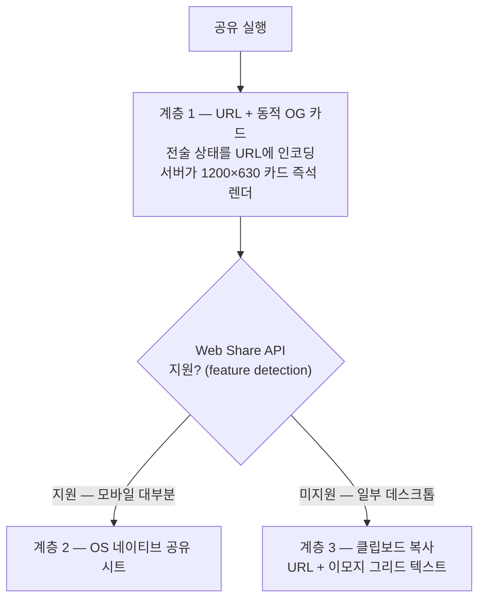

# 12. 결과 공유 설계

> 분량 목표: 1p · 방어: 참신성 30 + **1차 대중투표 전략** · 근거: P8

---

**핵심 메시지 — 공유는 부가 기능이 아니라 1차 투표(참가자 가중 80%)의 전략이다. 검증된
5요소로 설계했다.**

1차 평가는 대중 투표이고 투표 주체의 80%가 제출팀·참가팀이다. 서비스가 참가자들 사이에서
실제로 돌아다녀야 심사대에 오른다 — 그래서 공유를 검증된 바이럴 사례의 1차 출처에서
역설계했다 (P8).

## 공유를 유발하는 5요소 — 검증 사례의 이식

| # | 요소 (출처: Wordle·Wrapped, P8) | 이 서비스의 구현 |
|---|---|---|
| ① | 스포일러 프리 | 카드는 결과 단정이 아닌 **확률 구조**만 노출 |
| ② | 드라마의 압축 | 포메이션 미니맵 + 슬라이더 설정 + 승/무/패 밴드 — 한 장에 전술 서사 |
| ③ | 공통 퍼즐 → 비교 가능성 | 리플레이 3경기는 모두에게 같은 문제 — **"같은 멕시코전, 다른 전술"**. 카드에 경기 식별자(상대 국기+라운드) 필수 포함 |
| ④ | 플랫폼 독립 텍스트 | 확률 아이콘 배열을 이모지 그리드로 번역한 텍스트 공유 — 어디든 붙여넣기 가능 |
| ⑤ | 관찰의 제품화 | "데이터 스토리 1개당 공유 카드 1개" 원칙 — 시뮬레이션 결과마다 **내 전술 카드** 1:1 대응 |

## 기술 계층 — 3계층 폴백으로 어떤 환경에서도 성립

- **카카오톡 미리보기는 앱 키 없이 성립한다** (P8): 카톡은 OG 태그를 자동 스크래핑하므로
  계층 1만으로 미리보기 카드가 완성된다 — "심사자 별도 키 없이" 규칙과 정합. 앱 키가
  필요한 SDK 공유는 처음부터 기각했다
- **공유 URL은 결과가 아니라 전술 상태를 담는다** (P8): 수신자의 브라우저가 상태를 복원해
  **다시 계산**하므로 서버 저장이 없고, URL 변조도 기본 상태 복귀·경계값 보정으로 안전하게
  흡수된다
- Web Share API는 브라우저별 지원 편차가 있어 feature detection을 필수로 하고(P8),
  미지원 환경은 클립보드 계층이 받는다 — 공유가 실패하는 환경이 없다

## 규정 준수 — 공유물도 노출 표면이다

공유 카드·OG 이미지·이모지 그리드 전부에 13절의 에셋 가이드가 그대로 적용된다: 완전 가공명,
FIFA 공식 IP 배제, 국기+자체 그래픽만. 카드 문구도 "다른 선택지" 관점의 카피 검수 대상이다 —
예: "감독님의 선택은 달랐다" ○ / 특정 인물 판단의 규정 ×.

`[조판: ① 공유 3계층 폴백 다이어그램(위 mermaid 렌더) ② 내 전술 카드 목업 — 포메이션 미니맵
(가공명 토큰)+슬라이더 4종 설정+승/무/패 확률 밴드+경기 식별자(국기·라운드). 캡션 "한 장의
전술 서사 — 데이터 스토리 1개당 카드 1개 (P8)"]`

---

## 검수 메모 (조판 제외)

- [x] 골격 카드 확정 사항 소화: 5요소 ○ / 내 전술 카드(스토리 1:1) ○ / 3계층+feature detection ○ / 카톡 앱 키 불필요 ○ / URL 재추론 ○ / 경기 식별자 필수 ○
- [x] 금지·주의: 공유 카드에 P7 가이드 전면 적용 명시 / 카드 카피 비하 검수 기준 예시 포함
- [x] 실명·비하 0건 · 분량 1p 내
