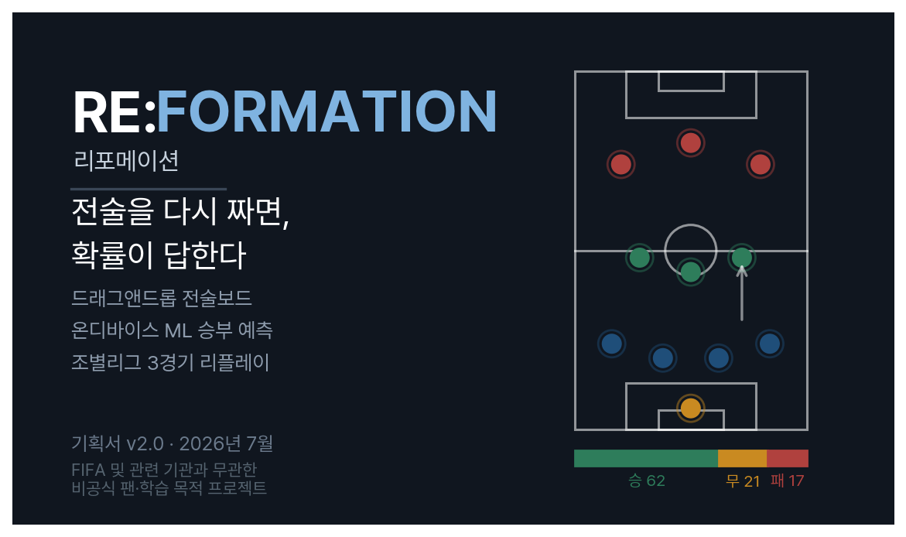

{width=100%}

\vspace{0.6em}

| | |
|:-------------------------------------|:---------------------------------------------------------------------|
| **1. 한 장 요약** | 무엇을 만들고, 무엇을 약속하며, 무엇을 약속하지 않는가 |
| **2. 두 계단** | 8위에서 끝난 진출선과 10위로 끝난 세 경기 |
| **3. 세 기능이 아니라 하나의 경험** | 손·판단·복기로 이어지는 감독의 동선 |
| **4. 비어 있는 사분면** | 조작은 정밀한데 예측이 없고, 예측은 있는데 조작이 성기다 |
| **5. 몰입은 취향이 아니라 지연 시간의 문제다** | 100ms·1초·10초로 설계한 조작감 |
| **6. 화면은 셋이면 충분하다** | 전술보드 · 리플레이 · 공유 랜딩 |
| **7. 작동을 약속하려면 예산부터 적어야 한다** | 상태 전이 · 접근성 대안 · 지연 예산 |
| **8. 실명은 파이프라인 안에서 멈춘다** | 학습층과 표시층을 스키마로 가르는 2계층 전략 |
| **9. 학습은 우리가, 추론은 심사자의 기기가** | 자체 Elo · 2단 모델 · 온디바이스 실행 |
| **10. 심사자의 10분** | 설치·가입·키 입력 0회의 동선 |
| **11. 공유는 부가 기능이 아니라 1차 투표의 전략이다** | 검증된 5요소와 3계층 폴백 |
| **12. 실격은 설계로 막는다** | 가공명 · 상징 배제 · 라이선스 매트릭스 |
| **13. 심사 조건을 스택으로 보장한다** | 외부 API 0개의 배포 구조 |
| **14. 실패가 소멸이 아니라 강등이 되게 한다** | 12일 로드맵과 리스크별 강등 계획 |
| **15. 부록** | 이 문서의 모든 수치는 어디서 왔는가 |
