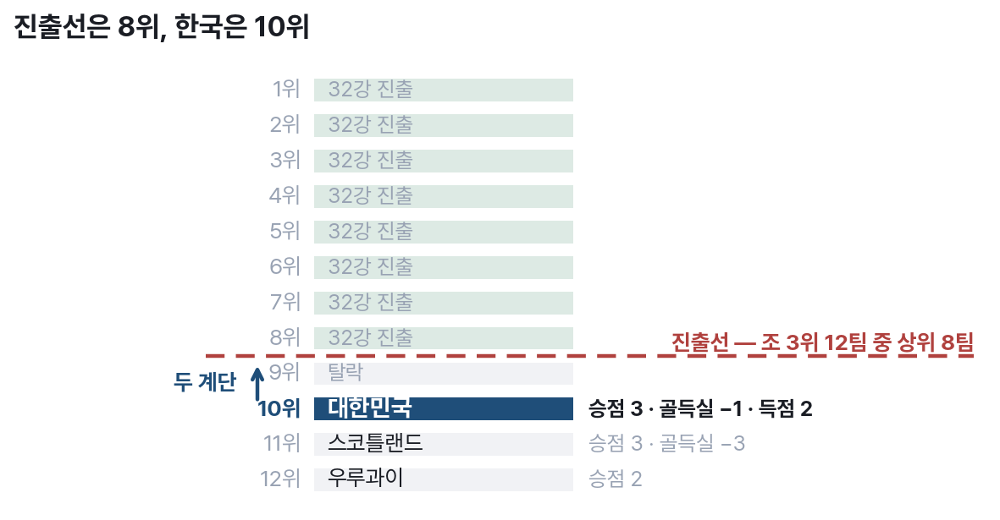
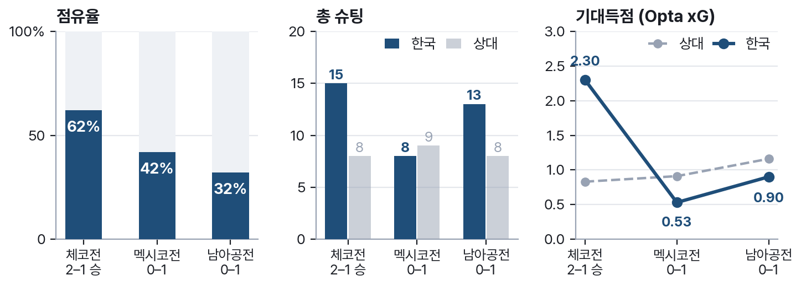

# 2. 두 계단

2026년 여름, 한국은 조별리그를 1승 2패 승점 3으로 마쳤다(P6). 이번 대회의 32강
진출 규칙은 각 조 1·2위 자동 진출에 더해 **조 3위 12팀 중 상위 8팀**에게 마지막
자리를 준다. 한국의 최종 성적 — 승점 3, 골득실 −1, 득점 2 — 는 그 12팀 가운데
10위였다. 진출선은 8위였다.

{width=92%}

한국보다 아래에 있던 팀은 골득실 −3의 스코틀랜드와 승점 2의 우루과이뿐이었다(P6).
두 계단. 골 하나, 승점 하나의 거리다. 이 거리가 이 서비스의 출발점이다. 결과가
크게 벌어졌다면 "다른 선택지"라는 물음 자체가 성립하지 않았을 것이다.

## 세 경기는 서로 다른 문제였다

세 경기는 모두 멕시코에서 열렸다(P11). 그런데 경기 내용을 나란히 놓으면 "아쉽게
졌다"는 한 문장으로 묶이지 않는다는 것이 곧 드러난다.

{width=100%}

1차전은 점유율 62%에 기대득점 2.30을 쌓아 2–1로 이겼다. 2차전은 점유율이 42%로
내려가고 기대득점이 0.53까지 떨어졌다. 3차전은 점유율이 32%까지 밀렸는데도 슈팅은
13개를 만들었고 기대득점은 0.90으로 오히려 2차전보다 높았다 — 만들고도 넣지 못한
경기다. 지배한 경기, 밀린 경기, 기회를 만들고도 마무리하지 못한 경기. **세 경기에는
서로 다른 처방이 필요했다.**

그래서 리플레이의 단위는 "대회"가 아니라 "경기의 한 시점"이다. 세 경기를 하나로
뭉뜽그리면 물음이 흐려지고, 시점을 고를 수 있어야 비로소 "이 순간에 라인을 올렸다면"
같은 구체적인 가정이 성립한다.

## 이 물음에는 지금까지 도구가 없었다

여기까지는 누구나 떠올릴 수 있는 이야기다. 문제는 그다음이다. 라인을 올렸다면
어땠을지, 다른 포메이션이었다면 어땠을지를 **실제로 시험해 볼 수단이 없었다.**
전술을 그려 보는 도구는 있지만 결과를 말해 주지 않고, 결과를 말해 주는 도구는
전술을 그리게 해 주지 않는다. 그 사정은 다음 절에서 조사 결과로 확인한다.

RE:FORMATION은 이 물음을 조작 가능한 화면으로 옮긴다. 전술을 직접 바꾸고, 그 선택의
확률을 즉시 확인하고, 실제 경기의 한 시점으로 돌아가 다른 선택지를 대입한다. 결과를
되돌릴 수는 없다. 다만 물음에는 이제 도구가 생긴다.

한 가지는 처음부터 분명히 해 둔다. 이 서비스는 **누구의 판단도 "잘못"으로 규정하지
않는다.** 화면·카드·문서의 모든 문장은 "다른 선택지가 있었다"는 관점으로만 쓰이며,
이 규율은 12절에서 문장 단위 검수 규칙으로 다시 다룬다.

> 본 서비스는 FIFA 및 관련 기관과 무관한 비공식 팬·학습 목적 프로젝트다(12절).
