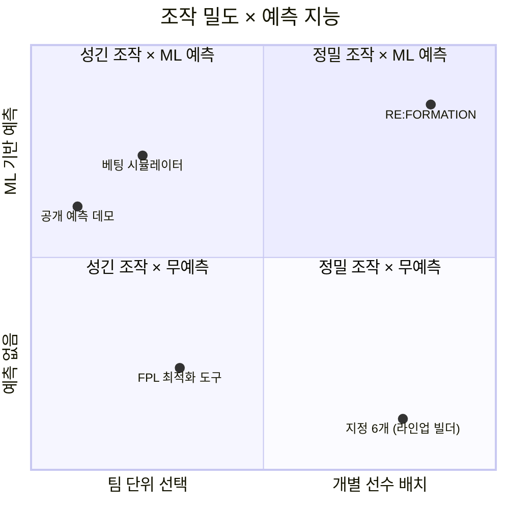

# 4. 비어 있는 사분면

"없는 것 같다"는 인상은 근거가 아니다. 그래서 전술보드·라인업 빌더로 지정된 6개와
인접 영역(FPL 최적화 도구, 베팅 시뮬레이터, 공개 데모 등) 30여 개를 실제로 열어
기능을 확인했다(P1).

지정된 6개는 **전부 예측 기능이 없었다.** 라인업을 그리고 이미지를 만들어 공유하는
데까지가 이들의 기능 범위다.

| 서비스 | 핵심 기능 | 승부 예측 |
|:----------------------------------|:-------------------------------------------------------|:----------------|
| buildlineup.com | 라인업 이미지 제작·공유 | 없음 |
| chosen11.com | 라인업 제작 | 없음 |
| lineup-builder.co.uk | 라인업 제작 (전술 옵션 다양) | 없음* |
| footballuser.com | 전술 보드 | 없음 |
| tactical-board.com | 화이트보드형 전술판 | 없음 |
| sharemytactics.com | 라인업 공유 | 없음 |

\* lineup-builder.co.uk의 "38-0-0" 모드는 선수 능력치를 단순 합산해 시즌 성적을
추산한다. 엄밀히는 완전한 무예측이 아니므로 각주로 남긴다. 다만 경기 단위 승부
예측도 아니고 배치·전술과 결합된 계산도 아니어서, 아래 판단을 바꾸지는 않는다(P1).

반대편도 확인했다. 예측 기능을 가진 인접 서비스 30여 개의 조작 단위는 "팀 선택"
또는 "팀 레이팅 슬라이더"에 머물렀다. **개별 선수의 배치나 포메이션 변경과 결합된
예측은 조사 범위 안에서 발견되지 않았다**〔추정 — P1 조사 범위 내〕.

두 축으로 놓으면 지형이 분명해진다. 오른쪽 아래에는 조작이 정밀하지만 예측이 없는
라인업 빌더들이 모여 있고, 왼쪽 위에는 예측은 하지만 조작이 성긴 시뮬레이터들이 있다.
**오른쪽 위 — 정밀한 조작과 ML 예측이 만나는 자리 — 가 비어 있다.**

## "기술적으로 어려워서 비어 있는 것 아닌가"

심사자가 당연히 물을 만한 반론이다. 조사 결과가 시사하는 답은 다르다. 라인업
빌더류의 수익 구조는 "라인업 이미지의 소셜 공유"이고, 그 구조에서 예측 기능은
필요하지 않았다〔추정 — P1〕. 즉 이 공백은 기술 장벽이 아니라 **사업 모델이 남긴
자리**로 보인다. 실제로 우리가 쓰는 부품은 전부 검증된 것들이다 — 경량 부스팅 모델,
ONNX 변환, 브라우저 wasm 추론(9절). 새로운 것은 부품이 아니라 조합이다.

## 같은 조사가 알려 준 위험

선례가 없다는 사실에는 다른 얼굴도 있다. **비교할 벤치마크가 없다**는 뜻이기 때문이다.
"이 정도면 잘 나온 건가"를 판정해 줄 선행 서비스가 없으므로, 성능이 기대에 못 미쳐도
그것을 알아차릴 기준이 우리 안에 없다. 이 위험은 숨기지 않고 두 가지로 관리한다.
첫째, 성능 기준을 우리가 정하지 않고 학술·상용 공개 실측이 놓인 자리에서 가져온다
(9절). 둘째, 미달했을 때의 대응을 미리 정해 둔다(14절). 참신성의 근거와 완성도의
위험이 같은 조사에서 나왔다는 사실 자체를 기록해 둔다(P1).
