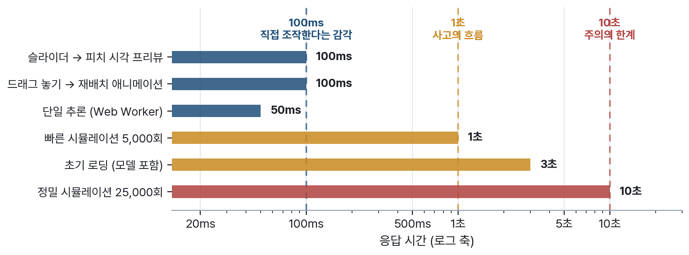

# 5. 몰입은 취향이 아니라 지연 시간의 문제다 〔대회 필수 ②〕

"감독이 된 것 같다"는 느낌은 분위기나 색감에서 나오지 않는다. 그 느낌이 성립하거나
무너지는 지점은 대부분 **응답 시간**과 **말의 단위**, 그리고 **첫 화면**이다. 이
절은 그 세 가지를 설계 근거와 함께 적는다.

## 조작감의 임계는 100밀리초다

사용자가 "내가 직접 움직이고 있다"고 느끼는 응답 임계는 100ms이고, 1초를 넘으면
사고의 흐름이 끊기며, 10초를 넘으면 주의가 화면을 떠난다(P5). 문제는 몬테카를로
시뮬레이션이 이 예산 안에 들어올 수 없다는 데 있다. 그래서 반응을 두 겹으로 나눴다.

**손이 닿는 것은 100ms 안에 움직인다.** 슬라이더를 밀면 수비 라인 가이드가 오르고
압박 음영이 짙어지고 대형이 벌어진다 — 이 프리뷰는 순수 그리기 연산이라 모델을
기다리지 않는다. **무거운 계산은 손을 뗀 뒤에 돈다.** 조작이 끝나는 시점을 감지해
시뮬레이션을 시작하고, 그 사이 화면에는 직전 결과가 그대로 남아 있다.

{width=100%}

드래그 자체의 미세 동작도 검증된 패턴을 따른다(P5): 잡을 수 있음을 알리는 커서
변화, 잡았음을 알리는 고스트와 그림자, 놓았을 때 약 100ms의 재배치 애니메이션,
시각 경계보다 넓게 잡은 드롭존, 그리고 언제든 취소할 수 있는 탈출구.

## 감독은 토글이 아니라 정도로 말한다

"수비적 / 공격적" 이분법 토글은 감독의 사고를 담지 못한다. 감독은 "조금 더 올려"라고
말하지 "수비 모드"라고 말하지 않는다. 연속 슬라이더가 감독 행위감을 살린다는
사용성 근거도 같은 방향을 가리킨다(P5).

다만 연속값에는 대가가 있다. 축구 담론에 익숙하지 않은 사용자는 "라인 높이 0.7"이
무슨 뜻인지 모른다. 그래서 모든 슬라이더에 **"낮음 / 보통 / 높음" 질적 라벨을
병기**하고, 값이 바뀌는 순간 피치가 자기 언어로 대답하게 했다. 숫자를 읽지 못해도
그림이 바뀌는 것은 보인다.

슬라이더가 네 개인 것도 결정이다. 조절할 수 있는 것이 많을수록 조작감은 올라가지만
첫 화면의 인지 부담도 함께 올라간다. 라인 높이·압박 강도·공격 폭·템포는 서로 다른
축을 건드리면서 피치 위에 즉시 그려낼 수 있는 최소 조합이다.

## 첫 화면은 이미 완성되어 있다

빈 보드로 시작하는 서비스는 첫 방문자에게 숙제를 준다. 심사자에게는 특히 그렇다 —
무엇을 해야 할지 모르는 10초가 지나가면 그 서비스는 이미 한 번 진 것이다.

RE:FORMATION의 첫 화면은 **채워진 상태로 시작한다.** 4-3-3 기본 배치와 슬라이더
중앙값, 그리고 그 상태의 예측 확률이 진입 시점에 이미 표시되어 있다(P5). 심사자는
설명을 읽을 필요 없이 아무것이나 만져 보면 되고, 무엇을 만지든 확률이 따라 움직이기
때문에 1~2초 안에 이 서비스의 구조를 스스로 발견한다. 포메이션 변경·정밀 모드·
애니메이션 옵션 같은 세부는 접힌 상태로 두어(P5) 첫 만남의 부담을 슬라이더 넷과
예측 패널로 제한했다.

## 확률은 정직해야 생생하다

"62%"라는 숫자 하나는 오독되기 쉽다. 62%를 확신으로 읽으면 결과가 어긋났을 때
서비스를 믿지 않게 되고, 신뢰구간만 강조하면 아무 말도 하지 않은 것처럼 보인다.
그래서 확률은 늘 세 겹으로 보여 준다 — 100칸 중 62칸이 채워진 아이콘 배열,
퍼센트 숫자, 그리고 신뢰구간 밴드(P12, 상세는 7절).

불확실성을 감추지 않는 표현이 오히려 몰입을 만든다고 본다. 감독의 세계에 확실한
승리는 없고, 확률을 앞에 두고 결정하는 일이야말로 감독이 하는 일이기 때문이다.
