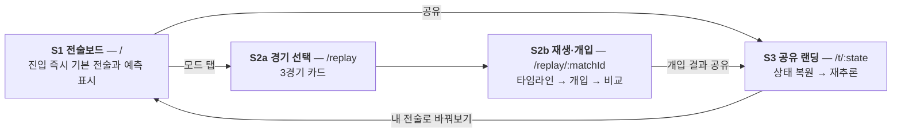
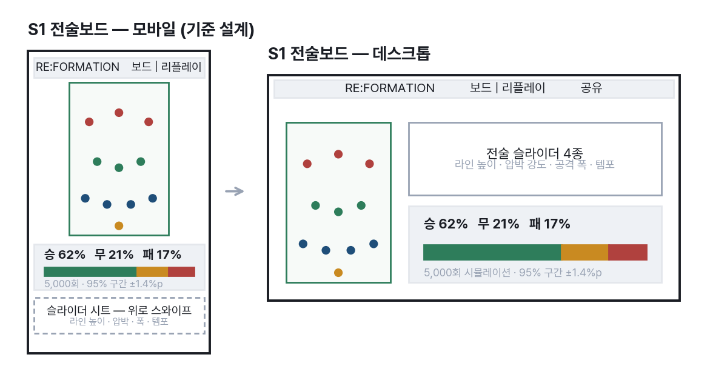
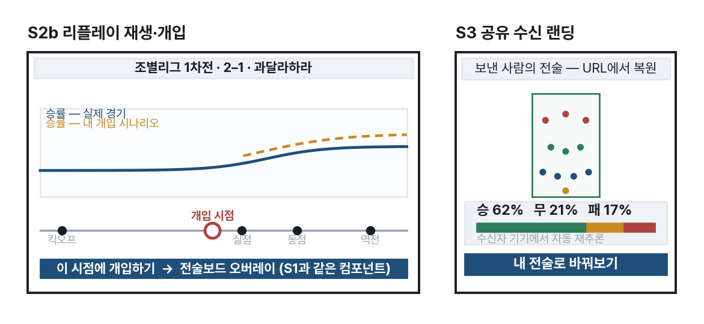

# 6. 화면은 셋이면 충분하다 〔대회 필수 ③〕

페이지를 늘리지 않은 것 자체가 설계다. 핵심 경험인 "조작 → 예측"은 이동 없이 한
화면에서 끝나야 하고, 화면을 옮겨야 할 이유가 생기는 것은 리플레이와 공유 수신
두 경우뿐이다. 화면이 적을수록 심사자가 길을 잃을 확률도, 우리가 12일 안에 완성하지
못할 확률도 함께 줄어든다.

전 화면은 **모바일 레이아웃이 기준 설계**다. 심사자가 링크를 휴대폰으로 열 가능성을
전제로, 데스크톱은 모바일 구조를 넓힌 형태로 파생시킨다.

화살표가 곧 사용자의 이동 경로다. 이 그림에서 가장 중요한 선은 오른쪽 끝에서 왼쪽
처음으로 돌아오는 **S3 → S1**이다. 받은 사람이 보낸 사람의 전술을 이어받아 조작을
시작하는 이 한 줄이 공유를 순환으로 만든다(11절).

## S1 전술보드 — 메인

{width=100%}

모바일에서는 헤더, 세로 방향 피치, 하단 고정 예측 패널, 위로 스와이프해 여는 슬라이더
시트 순으로 쌓인다. 예측 패널을 하단에 고정한 것은 피치를 조작하는 엄지와 확률을
읽는 시선이 겹치지 않게 하기 위해서다. 데스크톱에서는 피치가 왼쪽 2/3를 차지하고
오른쪽에 슬라이더와 예측이 세로로 붙는다.

선수 토큰은 **가공명의 성 한 음절 + 포지션 색상 링**으로 표기하고, 탭하면 전체
가공명이 툴팁으로 나온다(P7). 지름 1cm 안팎의 터치 타겟에서 읽히면서 색맹 사용자에게도
정보가 전달되어야 하므로 색과 텍스트를 함께 쓴다. 실명을 쓰지 않는 이유는 12절에서
법리와 함께 다룬다.

## S2b 리플레이 재생·개입, S3 공유 랜딩

{width=100%}

리플레이 화면의 승률 라인은 두 줄이다. 실선은 실제 경기의 흐름이고, 점선은 내가
개입한 시나리오다. 두 선이 갈라지는 지점이 곧 내 선택이 만든 차이이며, 비교는 언제나
확률과 구간으로만 말한다 — **"이겼을 것"이라는 단정은 어디에도 두지 않는다.**

"이 시점에 개입하기"를 누르면 S1의 전술보드가 그대로 오버레이로 열린다. 사용자는
조작법을 다시 배우지 않고, 우리는 컴포넌트를 하나만 만든다. xG를 표시하는 자리에는
산출 출처 라벨을 상시 병기한다 — 같은 경기라도 모델이 다르면 값이 다르기 때문이며,
이는 실제로 확인된 사실이다(8절·P13).

공유 랜딩의 존재 이유는 하단 버튼 하나로 요약된다. 받은 사람이 **1탭으로 조작
경험에 도달**하지 못하면 공유는 순환이 되지 못하고 스크린샷으로 끝난다.

## 빈 화면은 설계상 존재하지 않는다

어떤 상태에서도 사용자가 흰 화면을 보지 않는 것을 규칙으로 삼았다. 아래 표는 그
규칙을 상태별로 푼 것이다.

| 상태 | 화면이 하는 일 | 근거 |
|:-----------------------|:-------------------------------------------------------------------|:---------------|
| 초기 로딩 | 기본값 화면을 먼저 그리고 모델은 뒤에서 로드 | P4·P5 |
| 추론 중 | 직전 결과를 유지한 채 갱신 인디케이터만 표시 | P5 |
| 정밀 시뮬레이션 중 | 진행률과 취소 버튼 제공 (10초 임계) | P5·P12 |
| 추론 엔진 실패 | 순수 JS 통계 폴백 + "간이 추정" 배지, 패널은 유지 | P4·P12 |
| 데이터 없음 | **해당 없음** — 전 화면이 기본값으로 채워져 시작 | P5 |
