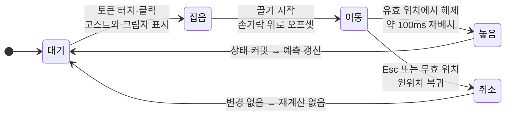
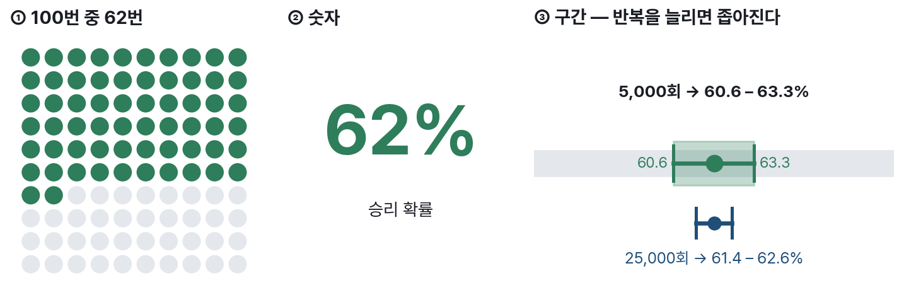
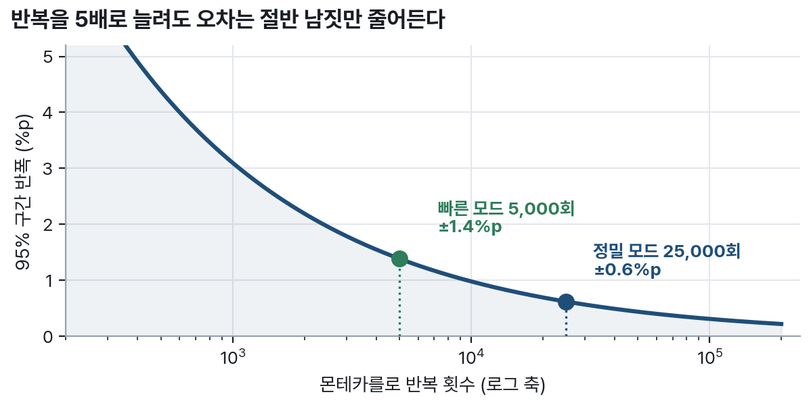

# 7. 작동을 약속하려면 예산부터 적어야 한다 〔대회 필수 ④〕

대회 규칙은 분명하다. 동적 인터랙션이 실제로 작동하지 않으면 그 기능은 평가에서
제외된다. 그래서 이 절에 적은 것은 전부 구현 대상이고, 구현이 불확실한 것은 애초에
적지 않았다. 아래 명세는 상태 전이·대안 경로·시간 예산의 세 층으로 되어 있다.

## 드래그앤드롭 — 상태로 적으면 빠지는 경우가 없다

전이를 그림으로 고정하면 두 가지가 자동으로 확정된다. 첫째, **취소 경로에서는
재계산이 일어나지 않는다** — 사용자가 마음을 바꿨을 뿐인데 확률이 흔들리면 조작에
대한 신뢰가 깨진다. 둘째, 예측 갱신을 트리거하는 지점이 "놓음 → 대기" 단 하나이므로
중복 계산이 구조적으로 발생하지 않는다.

각 상태의 시각 피드백은 검증된 패턴을 따르고(P5), 드롭존은 시각 경계보다 넓게 잡아
모바일의 손가락 오차를 흡수한다.

## 드래그의 대안은 편의가 아니라 요건이다

드래그로만 조작할 수 있는 인터페이스는 접근성 기준에 걸린다. 두 경로를 **독립
요건**으로 구현한다.

- **클릭-클릭**: 토큰을 탭하고 목적지를 탭하는 두 번의 동작으로 모든 드래그를 대신한다.
  드래그 동작에 대한 단일 포인터 대안 요구(WCAG 2.5.7, AA)에 대응한다(P5).
- **키보드**: Tab으로 토큰을 순회하고 Space로 집고 방향키로 옮기고 Enter로 놓고
  Esc로 취소한다. 위 항목과 별개의 요건이므로 따로 구현하고 따로 검증한다(P5).

모바일 터치 타겟은 1cm 이상으로 두고, 드래그 중 피드백은 손가락에 가리지 않도록
위쪽으로 오프셋한다(P5).

## 슬라이더 — 프리뷰와 계산을 분리한다

슬라이더 값이 바뀌면 100ms 안에 시각 프리뷰가 반응하고, 손을 뗀 뒤에야 시뮬레이션이
돈다(5절). 여기서 실제로 문제가 되는 것은 **경쟁 상태**다. 계산 중에 사용자가 다시
조작하면, 먼저 시작한 계산이 나중에 끝나면서 최신 화면을 옛 결과로 덮어쓸 수 있다.
그래서 재조작이 감지되면 진행 중인 계산을 **취소하고 최신 값으로 재시작**한다. 화면에
표시되는 확률은 항상 현재 전술의 것이라는 불변식을 설계 단계에서 못 박는 것이다.

## 지연 예산 — 성능을 약속의 형태로 적는다

| 인터랙션 | 예산 | 초과 시 처리 | 근거 |
|:-------------------------------|:-------------|:----------------------------------------------|:-------------|
| 슬라이더 → 시각 프리뷰 | ≤100ms | 프리뷰 효과를 단계 축소(음영→선), 값 반영은 유지 | P5 |
| 드래그 재배치 애니메이션 | 약 100ms | — | P5 |
| 단일 추론 (Web Worker) | ≤50ms 〔설계 목표〕 | — | P4 |
| 빠른 시뮬레이션 5,000회 | ≤1초 | 반복 수 자동 강등 + 강등 사실 표기 | P5·P12 |
| 정밀 시뮬레이션 25,000회 | ≤10초 | **진행률 바 + 취소 버튼 필수** | P5·P12 |
| 초기 로딩 (모델 포함) | ≤3초 〔설계 목표〕 | 기본값 화면을 먼저 표시 | P4 |

〔설계 목표〕로 표시한 두 항목은 우리가 아직 실측하지 않은 값이다. 8/2 실기기 검증
단계에서 계측해 확정하며(14절), 미달하면 수치를 고치지 않고 대응을 고친다.

## 확률은 단독 수치로 내보내지 않는다

{width=100%}

세 표현은 서로 다른 오독을 막는다. 아이콘 배열은 확률을 빈도로 번역해 "62%"를
"100번 중 62번"으로 읽게 하고, 숫자는 정확한 비교를 가능하게 하며, 구간은 이 값이
얼마나 흔들릴 수 있는지를 말한다. 구간은 **Wilson score** 방식으로 계산한다 —
확률이 0%나 100%에 가까워져도 구간이 [0, 1]을 벗어나지 않고, 순수 JS로 즉시
계산되므로 추론 엔진이 실패한 폴백 모드에서도 그대로 동작하기 때문이다(P12).
스크린리더에는 "승리 확률 62퍼센트, 100번 중 62번"처럼 텍스트 라벨을 함께 노출한다.

반복 횟수를 두 모드로 나눈 이유도 여기서 나온다.

{width=96%}

빠른 모드 5,000회는 1초 안에 ±1.4%p 수준의 구간을 준다. 정밀 모드 25,000회는 5배의
시간을 쓰고 오차를 절반 남짓 줄인다. 어느 쪽이든 화면에는 반복 횟수를 함께 적는다 —
"5,000회 시뮬레이션"이라는 한 줄이 그 확률을 어디까지 믿어야 하는지 알려 준다.

여러 시나리오를 비교할 때는 **가설적 결과 애니메이션**을 옵션으로 제공한다. 프레임
하나가 시뮬레이션 1회의 결과이고 400ms마다 바뀌므로, 불확실성이 정적 그림이 아니라
움직임으로 전달된다(P12). 다만 운영체제의 동작 축소 설정이 켜져 있으면 자동 재생을
끈다.
