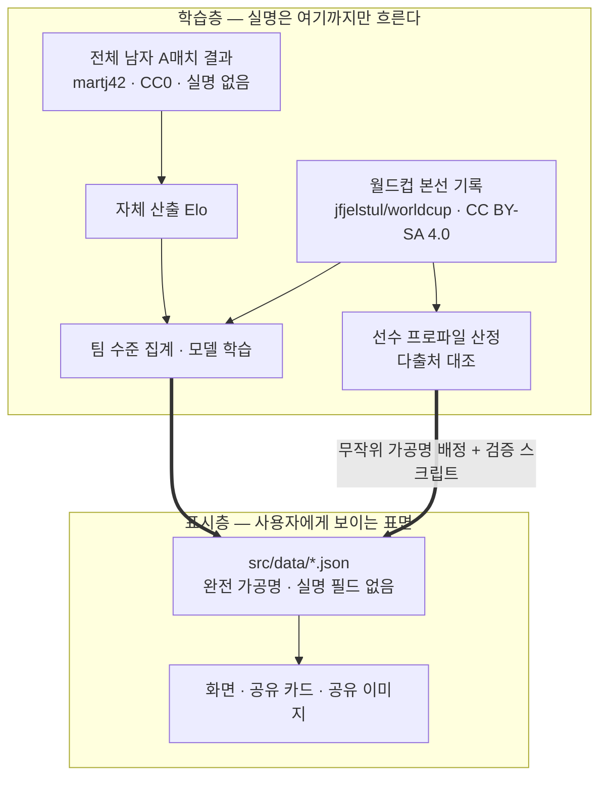

# 8. 실명은 파이프라인 안에서 멈춘다 〔대회 필수 ⑤〕

데이터에는 상충하는 두 요구가 걸린다. 모델은 실제 기록으로 학습해야 정확하고, 화면은
실명을 노출하지 않아야 안전하다. 둘 다 만족시키는 방법은 하나뿐이다 — **실명이
흐르는 구간을 스키마 수준에서 끊는 것.**

## 학습층 — 두 개의 출처, 서로 다른 역할

1차 출처는 학술 목적으로 공개된 월드컵 본선 데이터셋 `jfjelstul/worldcup`(CC BY-SA
4.0, 원저작자 배포)이다(P2·P10). 여기서 나오는 경기 결과·득점·출전 기록이 라벨과
피처의 바탕이 된다.

2차 출처는 `martj42/international_results`(CC0 1.0)로, 1872년 이후 전체 남자 A매치
결과를 담고 있다. 이 저장소에서 우리가 내려받는 파일은 팀명과 스코어만 있는
`results.csv` 하나뿐이다 — **선수명 컬럼이 아예 없고**, 실명이 포함된
`goalscorers.csv`는 수집 대상에서 구조적으로 제외했다. 퍼블릭 도메인이라 라이선스
부담도 없다. 본선 964경기로 산출하던 팀 강도를 A매치 49,520경기로 넓힌 근거가
여기에 있고, 그 효과는 9절에서 실측으로 보인다.

채택하지 않은 후보도 기록해 둔다. 공개 플랫폼에 재업로드된 상용 이벤트 데이터 2건은
**카드에 적힌 라이선스 표기(CC BY-SA)와 원 계약 조건(비상업·재배포 금지)이 문구
단위로 어긋나는 것이 확인되어 사용을 금지했다**(P10). 라이선스는 재업로드로
세탁되지 않는다.

## 표시층 — 화면에 도달하는 것은 가공명뿐

화면·공유 이미지·클라이언트 JSON에는 완전 가공명만 도달한다. 선수 능력 프로파일은
어느 한 상업 DB를 그대로 복제하지 않고 **여러 독립 출처를 대조해 직접 산정**한다 —
단일 데이터베이스의 체계적 추출은 그 자체로 데이터베이스권 문제를 부르기 때문이다(P10).

데이터는 처음부터 정적 JSON(`src/data/*.json` + TypeScript 타입)으로 구성한다.
주최 측이 안내한 "더미 데이터 직접 구성·JSON 권장"과도 맞고, 무엇보다 **JSON
스키마에 실명 필드 자체가 없어 실수로도 실명이 화면에 도달할 수 없다.** 여기에 빌드
시점 검증 스크립트가 참조 무결성·실명 유사도·타입을 검사한다. 규칙을 사람의 주의력이
아니라 타입과 스크립트에 맡기는 것이 이 설계의 요점이다.

## 리플레이 — 확정된 것만 데이터가 된다

리플레이 세 경기의 표시값은 공식 매치리포트 원문을 직접 대조해 확정한 것만 쓴다
(P11·P13).

| 경기 | 개최지 | 결과 | 타임라인 |
|:--------------------|:--------------------|:----------------|:-------------------------------------------------|
| 1차전 (체코) | 과달라하라 | **2–1 승** | 59' 실점 → 67' 동점 → 80' 역전 |
| 2차전 (멕시코) | 과달라하라 | 0–1 | 후반 초반 실점 |
| 3차전 (남아공) | 몬테레이 | 0–1 | 63' 실점 · 하프타임 교체 |

원칙은 하나다. **재대조가 끝나지 않은 항목은 데이터에 행 자체를 만들지 않는다.**
"확정되지 않은 것은 표시하지 않는다"를 UI가 아니라 데이터 수준에서 보장하기 위해서다.

이 원칙이 왜 필요한지는 실제 대조 과정에서 드러났다. 3차전의 경고 수는 공식 집계와
2차 자료가 어긋나 있었는데, 원문을 열어 보니 **65분의 교체 기록이 다른 자료에서
경고로 잘못 옮겨진 것**이었다(P13). 2차 자료를 그대로 실었다면 사실이 아닌 이벤트가
타임라인에 남았을 것이다. 킥오프 시각도 마찬가지로, 공식 페이지의 메타데이터가 현지
시각에 UTC 표기를 붙여 둔 탓에 생긴 불일치였다(P13).

xG는 특히 조심해서 다룬다. 같은 3차전을 두고 공식 리포트 계열의 값과 상용 모델의
값이 서로 다르다는 사실을 원문에서 직접 확인했다(P13). 그래서 화면에서 xG를 표시할
때는 **어느 모델의 값인지를 라벨로 항상 병기**한다. 하나만 고르고 출처를 감추는 편이
화면은 깔끔하지만, 그것은 정확하지 않은 깔끔함이다.

교체·득점 같은 기용 관련 항목은 **사실만 기록하고 평가하지 않는다.** 데이터에도,
화면 문구에도 판단어를 넣지 않는다(12절).

## 라이선스 고지

1차 출처의 CC BY-SA 4.0은 동일조건변경허락 조항을 갖는다. 그래서 데이터 기반
산출물(집계 통계·모델)의 고지를 코드 라이선스와 **분리해** 저장소 최상위의
`DATA-LICENSE.md`에 둔다. 2차 출처는 CC0라 고지 의무가 없지만 투명성을 위해 같은
문서에 함께 적는다(P10). 상세는 12절.
