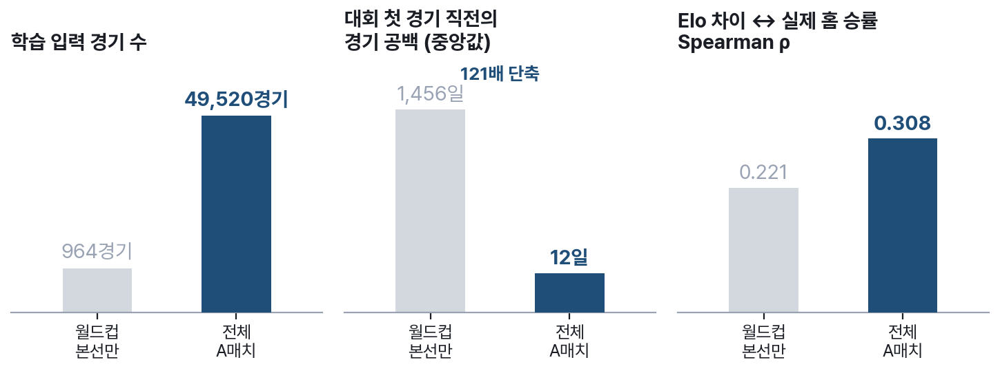
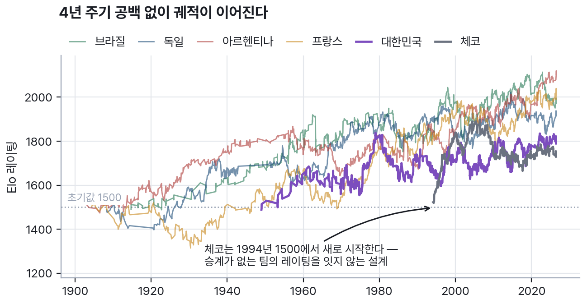
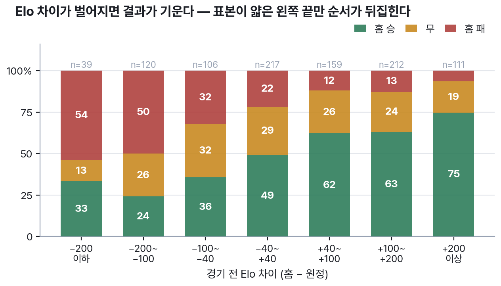
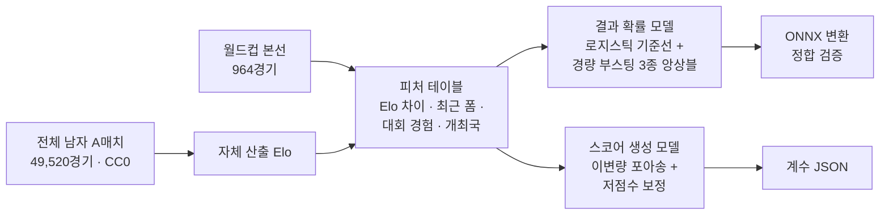
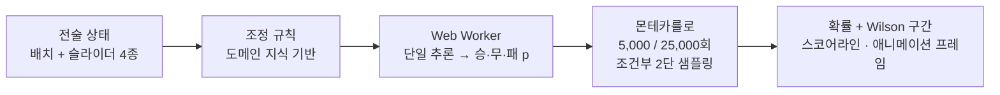
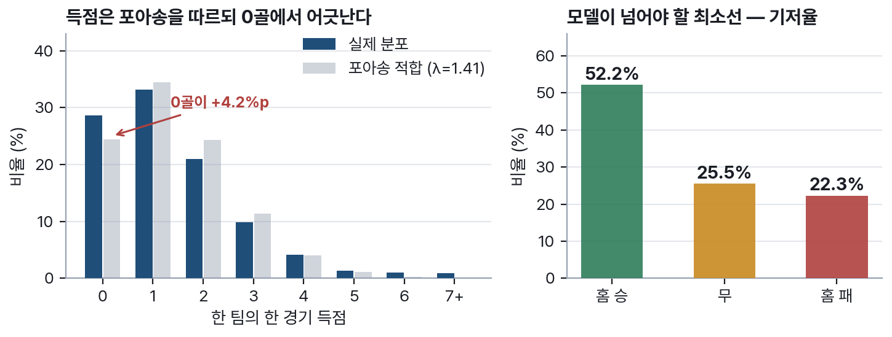
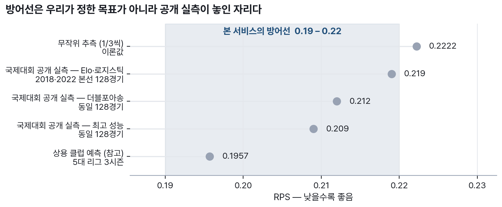

# 9. 학습은 우리가, 추론은 심사자의 기기가

가장 쉬운 길은 공개된 사전학습 모델을 가져다 미세조정하는 것이다. 그 길을 검토하고
기각했다. 축구 결과 예측의 공개 모델 생태계는 독립 검증이 붙은 사례가 얕고, 무엇보다
**라이선스는 미세조정으로 세탁되지 않는다** — 비상업 조건이 붙은 베이스 모델의 조건은
파생물에 그대로 승계된다(P9). 직접 학습한 경량 모델은 라이선스를 전적으로 우리가
통제하고, ONNX로 바꾸면 브라우저에서 확실히 돈다.

추론은 ONNX Runtime Web의 **wasm 전용 서브셋**(로더 약 47KB)으로 사용자 기기에서
실행한다(P4). 외부 API 호출이 0건이므로 "심사자가 별도 키 없이 확인"이라는 조건이
기능이 아니라 구조로 충족되고, 심사 중에 외부 장애가 우리 화면을 멈추게 할 지점도
없다.

## 팀 강도는 우리가 직접 계산한다

외부 레이팅 지수를 가져다 쓰면 산식이 남의 것이 되고 라이선스도 남의 것이 된다.
그래서 Elo를 경기 결과만으로 자체 산출한다 — K=32, 홈 어드밴티지 100(중립 경기
제외), 감쇠 없음.

여기서 실제로 문제가 됐던 것은 **입력의 희소성**이었다. 처음에는 월드컵 본선
964경기만으로 Elo를 계산했는데, 대회가 4년마다 열리다 보니 각 팀의 "대회 첫 경기"
시점에서 직전 경기까지의 공백이 중앙값 1,456일이었다. 4년 묵은 레이팅으로 경기를
예측하는 셈이라, 처음에는 공백만큼 레이팅을 감쇠시키는 보정 계수를 두려고 했다.

증상을 처치하는 대신 원인을 없애기로 하고, 입력을 A매치 전체로 넓혔다.

{width=100%}

공백 중앙값이 1,456일에서 12일로 줄었다. 감쇠 계수는 더 이상 필요하지 않아 설계에서
제거했다 — **보정을 정교하게 만드는 대신 보정이 필요 없게 만든 것**이 이 단계의
결론이다. 그리고 그 대가로 얻은 것도 수치로 확인된다. Elo 차이와 실제 홈 승률의
순위상관은 0.221에서 0.308로 올랐다.

{width=100%}

이 그림에는 한계도 같이 드러나 있다. 체코의 선이 1994년 1500에서 새로 시작하는데,
이는 **행정적으로 분리·계승된 팀의 레이팅을 잇지 않기로 한 설계**의 결과다. 어느
쪽이 옳다고 단정하기 어려운 문제라, 우리는 잇지 않는 쪽을 택하고 그 사실을 그림에
남겨 두었다. 신생 국가대표팀이 초기값 1500에서 출발한다는 점도 같은 성격의 한계다.

## Elo는 실제로 결과를 설명하는가

레이팅을 만들었다면 그것이 실제 결과와 맞물리는지 확인해야 한다. 964경기를 Elo 차이
구간으로 나눠 실제 90분 결과의 분포를 그렸다. 각 경기의 Elo는 **그 경기 이전의
A매치만으로 계산한 사전 레이팅**이며, 미래 정보가 새어 들어가지 않았음은 무작위
표본을 뽑아 전체 재생과 대조하는 방식으로 검증했다(오차 10⁻⁹ 미만).

{width=100%}

차이가 벌어질수록 결과가 기운다. 다만 **왼쪽 끝 구간에서는 순서가 뒤집힌다** —
Elo 차이가 −200 이하인 39경기의 홈 승률(33%)이 −200~−100 구간(24%)보다 높다.
표본이 39경기뿐인 구간이라 우연으로 볼 여지가 크지만, 이 그림을 매끄럽게 다듬지 않고
그대로 싣는 이유가 있다. **Elo 하나만으로는 부족하다**는 사실이 여기 그대로
보이기 때문이다. 최근 폼, 대회 경험, 개최국 여부 같은 피처를 더하고 부스팅 모델로
비선형을 잡는 이유가 이 그림에 있다.

## 두 개의 모델, 하나의 확률

**결과 확률 모델**은 Elo 차이를 핵심 공변량으로 하는 로지스틱 기준선 위에 경량 부스팅
모델 3종을 학습·튜닝해 앙상블한다. 기준선을 남겨 두는 것은 앙상블이 무너졌을 때
돌아갈 자리를 만들어 두기 위해서다(14절).

**스코어 생성 모델**은 이변량 포아송에 저점수 보정을 얹는다. 이 보정항이 왜 필요한지도
데이터로 확인했다.

{width=100%}

득점 분포는 전체적으로 포아송에 가깝지만 **0골이 적합보다 4.2%p 더 많다.** 축구에서
무득점은 우연보다 자주 일어나며, 이 어긋남을 그대로 두면 무승부와 0–0 스코어라인이
과소 추정된다. 오른쪽 패널의 기저율(홈 승 52.2% · 무 25.5% · 홈 패 22.3%)은 모델이
넘어야 할 최소선이다 — "항상 홈 승"이라고 답해도 52.2%는 맞기 때문이다.

두 모델을 잇는 방식에는 함정이 하나 있다. 확률 모델과 스코어 모델을 따로 돌리면
"승리 확률 62%"인데 시뮬레이션 스코어라인을 세어 보니 승리가 58%인 상황이 생긴다.
그래서 몬테카를로의 각 반복은 **먼저 결과 범주를 뽑고, 그 범주와 일치하는 스코어를
뽑는 조건부 2단 샘플링**으로 돈다. 시뮬레이션 집계가 화면의 단일 추론 확률과 어긋나는
일이 원리상 불가능해진다.

## 슬라이더가 학습된 것이 아니라는 사실을 감추지 않는다

여기서 정직해야 할 지점이 하나 있다. **역사 데이터에는 전술 성향 기록이 없다.**
1970년대 경기의 "압박 강도"를 적어 둔 데이터셋은 존재하지 않는다. 우리는 실제로
데이터셋의 컬럼을 전수 확인해 이 사실을 확정했다.

따라서 슬라이더와 배치는 학습된 효과가 아니라 **축구 도메인 지식으로 설계한 조정
규칙**으로 모델 입력(팀 강도·기대득점)을 제한된 범위 안에서 변형한다. 모든 슬라이더는
이득과 위험을 함께 갖는 양날 설계다 — 라인을 올리면 전방 압박이 강해지는 대신 뒷공간이
열린다. 그래서 "전부 최대 = 필승"이 성립하지 않는다.

**학습한 팀 강도 모델 + 설계한 전술 반응 규칙.** 이 구분을 문서와 화면에 함께
밝히는 것이 이 아키텍처의 정직성이고, 감추는 편이 더 그럴듯해 보인다는 것을 알면서도
밝히는 이유는 검증 가능한 것과 아닌 것을 섞으면 검증 가능한 쪽까지 의심받기
때문이다.

## 성능 기준은 우리가 정하지 않는다

{width=98%}

RPS는 순위형 예측의 오차를 재는 지표로, 낮을수록 좋고 무작위 추측이 0.2222다.
국제대회 128경기를 대상으로 한 공개 실측이 0.209~0.219, 정확도 0.508~0.547에
모여 있다(P12). 우리는 **RPS 0.19~0.22, 정확도 0.50~0.55**를 방어선으로 선언한다.
자의적인 목표가 아니라 같은 종류의 문제에서 실제로 나온 값들의 범위다.

중요한 것은 같은 자로 재는 것이다. 검증은 대회 단위 시간 분할 — 과거 대회로 학습,
2018년 대회로 검증, 2022년 대회로 최종 평가 1회 — 로 하며, 이는 방어선을 가져온
실측과 같은 측정 조건이다. 시뮬레이션 반복 횟수(5,000 / 25,000)도 상용 예측이
공개한 범위(20,000~25,000회)와 맞췄다(P12).

## 과정 자체가 산출물이다

학습 과정은 분석 노트북으로 공개한다. **수집·탐색 → EDA → 피처 엔지니어링 →
부스팅 3종 → 하이퍼파라미터 최적화 → 앙상블 → 해석 → 보고서**의 순서이며, 이 절에
실린 그림들이 전부 그 노트북의 산출이다. 반복 과정도 함께 남긴다 — 위에서 적은
"감쇠 계수를 넣으려다 입력을 넓혀 없앤" 경로처럼, 무엇을 시도했다가 왜 접었는지를
별도 원장에 기록한다. 1차 평가가 참가자 투표(가중 80%)라는 점을 고려하면, 결과보다
과정이 신뢰를 만든다고 판단했다.

## 남는 한계

국가대표팀 경기는 표본이 근본적으로 적다(연 8~12경기 수준, P3). 입력을 A매치로
넓혀 장기 공백 문제는 해소했지만, 신생팀의 초기값 문제와 승계 미연결 문제는 그대로
남는다. 앞의 캘리브레이션 그림에서 본 양 끝 구간의 불안정성도 마찬가지다.

그래서 이 서비스는 "예측한다"고 말하지 않고 **"확률을 제시한다"**고 말한다. 언제나
반복 횟수와 신뢰구간을 병기하고, 어떤 화면에도 단정 표현을 두지 않는다. 한계를 먼저
밝히는 것이 신뢰의 설계라고 본다.
