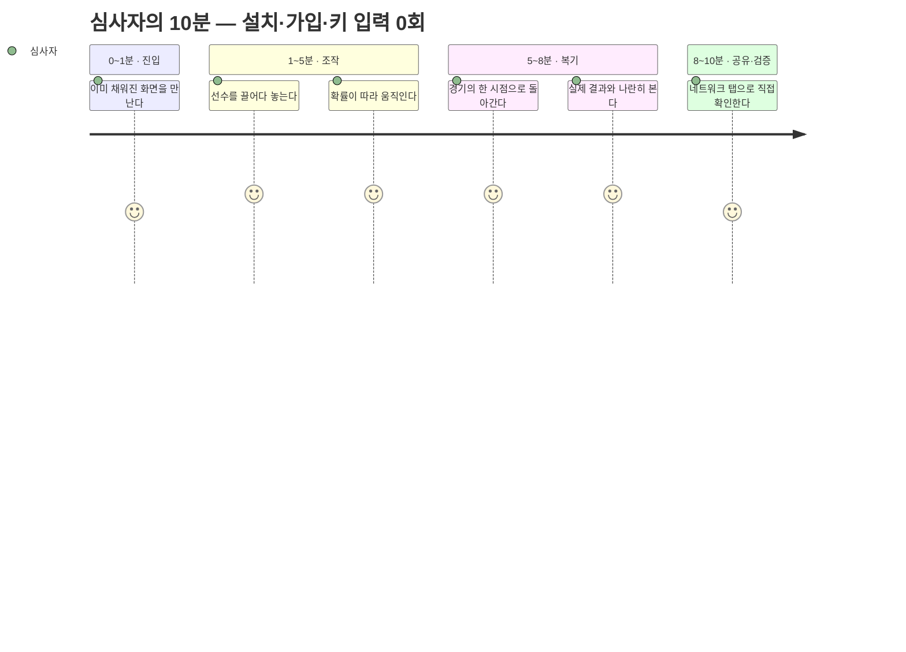

# 10. 심사자의 10분 〔대회 필수 ⑥〕

이 절의 모든 단계는 6절의 화면과 7절의 인터랙션 명세에 1:1로 대응한다. 새로 약속하는
기능은 없다.

## 메인 흐름 — 첫 방문에서 공유까지

링크를 열면 4-3-3 기본 배치와 슬라이더 중앙값, 그리고 그 상태의 예측이 **이미 표시된**
화면이 나온다. 여기서부터는 무엇을 만지든 반응이 온다. 선수를 옮기면 약 100ms의
재배치 애니메이션 뒤에 예측이 갱신되고, 슬라이더를 밀면 피치가 먼저 반응한 다음
손을 뗀 시점에 시뮬레이션이 돈다. 확률은 아이콘 배열·숫자·구간 세 겹으로 나오고,
더 정밀한 값을 원하면 25,000회 모드를 고를 수 있다 — 이때는 진행률과 취소 버튼이
함께 뜬다. 마지막으로 공유 버튼 하나로 내 전술이 카드와 URL이 된다.

## 리플레이 흐름 — "다른 선택지"의 시험

모드 탭에서 경기를 고르고, 타임라인과 승률 라인차트를 재생하다가 개입할 시점을
선택한다. 전술보드가 오버레이로 열리는데 조작법은 메인과 완전히 같다. 전술을 바꿔
다시 예측하면 실제 결과와 내 시나리오가 나란히 놓인다. 이 비교 화면은 항상 확률과
구간으로 말하며, **"이겼을 것"이라는 문장은 화면 어디에도 없다.** 결과가 마음에
들면 경기 식별자가 포함된 카드로 공유한다.

## 수신자 흐름 — 순환이 닫히는 곳

메신저 미리보기 카드는 앱 키 없이 성립한다(11절·P8). 받은 사람이 링크를 열면 URL에
인코딩된 전술 상태가 복원되고, **수신자의 브라우저에서 자동으로 다시 계산된다.**
서버에 저장된 것이 없기 때문에 가능한 일이다 — URL이 곧 전술이다. 하단 버튼 하나로
그 상태를 이어받은 채 전술보드에 진입해 자기 버전으로 고치고, 다시 공유한다.

## 10분 안에 확인되는 것들

| 분 | 심사자의 행동 | 이때 확인되는 것 |
|:-------|:-----------------------------------|:---------------------------------------------------------------|
| 0~1 | 모바일로 링크 진입 | 설치·가입 없이 즉시 완성된 화면 — 빈 화면이 없다 |
| 1~3 | 드래그, 슬라이더 조작 | 조작 직관성 · 100ms 반응 · 확률 실시간 갱신 |
| 3~5 | 확률 표현 탐색 (배열·구간·애니메이션) | 불확실성을 감추지 않는 표기 · 반복 횟수 명기 |
| 5~8 | 리플레이 진입 → 시점 개입 → 비교 | "내가 감독이라면"이 실제로 작동함 |
| 8~9 | 공유 카드 생성 → 미리보기 확인 | **키 입력 0회로 전 기능 도달** |
| 9~10 | 키보드 조작 · 네트워크 탭 확인 | 접근성 대안 경로 · 외부 API 호출 0건 |

마지막 줄이 이 표의 핵심이다. 심사자가 개발자 도구를 열어 네트워크 탭을 보는 순간,
"온디바이스 추론"이라는 주장은 설명이 아니라 **관찰 가능한 사실**이 된다.
