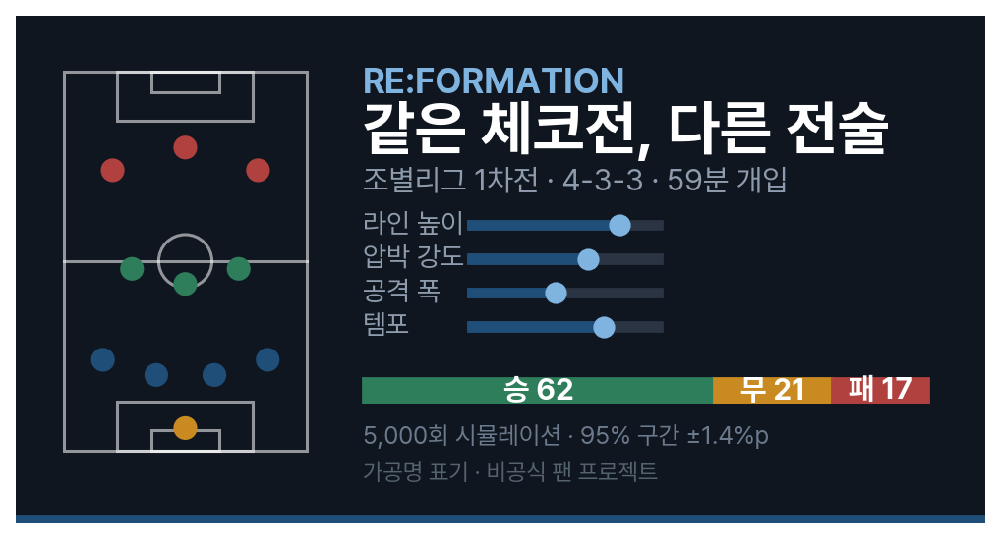
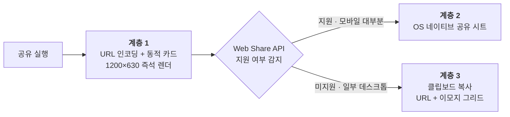

# 11. 공유는 부가 기능이 아니라 1차 투표의 전략이다

1차 평가는 대중 투표이고, 투표 주체의 80%가 제출팀·참가팀이다. 아무리 잘 만들어도
참가자들 사이에서 돌아다니지 않으면 심사대에 오르지 못한다. 그래서 공유를 "만들고
남으면 붙이는 기능"이 아니라 처음부터 설계 항목으로 다뤘고, 검증된 바이럴 사례를
1차 출처에서 역설계했다(P8).

## 무엇이 사람을 공유하게 만드는가

| 요소 | 원 사례에서의 작동 | 이 서비스의 구현 |
|:------------------|:--------------------------------------|:-------------------------------------------------|
| 스포일러가 없다 | 결과를 말하지 않아 받는 쪽의 재미를 뺏지 않는다 | 카드는 결과 단정이 아니라 **확률 구조**만 담는다 |
| 드라마가 압축된다 | 한 장에 이야기가 다 들어간다 | 포메이션 미니맵 + 슬라이더 4종 설정 + 승·무·패 밴드 |
| 같은 문제를 푼다 | 비교가 성립해야 대화가 시작된다 | 리플레이 3경기는 모두에게 같은 문제 — **"같은 경기, 다른 전술"** |
| 어디든 붙여넣어진다 | 플랫폼에 의존하지 않는 텍스트 형태 | 확률 아이콘 배열을 이모지 그리드로 번역한 텍스트 |
| 관찰이 곧 제품이다 | 결과 하나에 공유물 하나가 대응한다 | 시뮬레이션 결과마다 **내 전술 카드** 1:1 생성 |

세 번째 줄이 리플레이를 부가 기능이 아니게 만든다. 각자 다른 전술을 짜는 것만으로는
비교가 성립하지 않지만, **같은 경기의 같은 시점**이라는 공통 문제가 있으면 카드
두 장을 나란히 놓는 것만으로 대화가 시작된다. 그래서 카드에는 경기 식별자를 필수로
넣는다.

{width=88%}

## 공유가 실패하는 환경이 없게 한다

여기서 규칙과 직결되는 결정이 하나 있다. **메신저 미리보기는 앱 키 없이 성립한다.**
주요 메신저는 링크의 OG 태그를 자동으로 읽어 미리보기를 만들기 때문에, 계층 1만으로
카드가 완성된다(P8). SDK를 붙이면 기능은 늘지만 앱 키가 필요해지고, 그 순간
"심사자가 별도 키 없이 확인"이라는 조건이 깨진다. 그래서 SDK 방식은 처음부터
기각했다.

Web Share API는 브라우저별 지원 편차가 있으므로 기능 감지를 필수로 하고(P8), 미지원
환경은 클립보드 계층이 받는다. 어느 환경에서도 공유가 "실패"로 끝나지 않는다.

공유 URL이 담는 것은 결과가 아니라 **전술 상태**다. 수신자의 브라우저가 그 상태를
복원해 다시 계산하므로 서버 저장이 필요 없고, URL을 손으로 고쳐도 기본 상태 복귀와
경계값 보정으로 안전하게 흡수된다.

## 공유물도 노출 표면이다

공유 카드·OG 이미지·이모지 그리드 전부에 12절의 에셋 규칙이 그대로 적용된다 —
완전 가공명, 대회 공식 상징 배제, 국기와 자체 제작 그래픽만. 카드에 들어가는 문구도
비하 금지 검수 대상이다. "감독님의 선택은 달랐다"는 쓸 수 있고, 특정 인물의 판단을
규정하는 문장은 쓸 수 없다. 공유물은 우리 화면 밖으로 나가기 때문에 오히려 더
엄격하게 본다.
