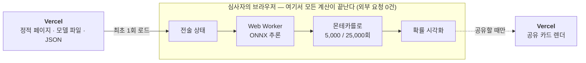

# 13. 심사 조건을 스택으로 보장한다

심사 조건 — 설치 없음, 가입 없음, 키 없음, 모바일에서 열림 — 은 노력으로 지키는
것이 아니라 구조로 지키는 편이 안전하다. 스택 선택은 전부 그 관점에서 내렸다.

| 선택 | 이유 | 이것이 막는 실패 |
|:---------------------------|:-------------------------------------------|:-----------------------------------|
| Next.js 15 (App Router, 서버 컴포넌트 우선) | 첫 화면을 서버가 완성해 보낸다 | JS가 실패해도 백지가 뜨지 않는다 |
| TypeScript strict + 스키마 검증 | 정적 JSON의 타입·참조 무결성을 빌드 시점에 검사 | 데이터 오류가 런타임에 처음 드러나는 일 |
| Tailwind + shadcn/ui | 모바일 우선 반응형이 기본값 | 심사자가 휴대폰으로 열었을 때의 깨짐 |
| Zustand + React Hook Form | 전술 상태를 한 곳에서 관리 | 화면 간 상태 불일치 |
| **ONNX Runtime Web (wasm)** | 추론을 Web Worker에서 기기 안에서 실행 | **외부 API 장애 · 키 요구 · 요금** |
| Vercel 배포 | 정적 자산(모델 포함) 직접 서빙 + 동적 카드 렌더 | 심사 기간 중 접근 불가 |
| Service Worker 캐싱 | 모델과 wasm을 캐시 | 불안정한 네트워크에서의 재현 실패 |

배포 구조는 단순하다. **정적 페이지 + 정적 모델 파일 + 브라우저 안의 계산.**
데이터베이스도 백엔드 API도 없으므로 "서버가 죽어서 안 열린다" 계열의 장애가 구조적으로
존재하지 않는다. 유일한 서버 코드는 공유 카드를 즉석에서 그리는 부분인데, 이것이
실패해도 기본 카드로 대체될 뿐 본 기능에는 영향이 없다(14절).

이 구조의 부수 효과가 하나 있다. 심사자가 네트워크 탭을 열면 모델 파일을 한 번
내려받은 뒤로는 **아무 요청도 오가지 않는 것**이 보인다. 온디바이스 추론이라는 주장이
문장이 아니라 관찰로 확인된다.
