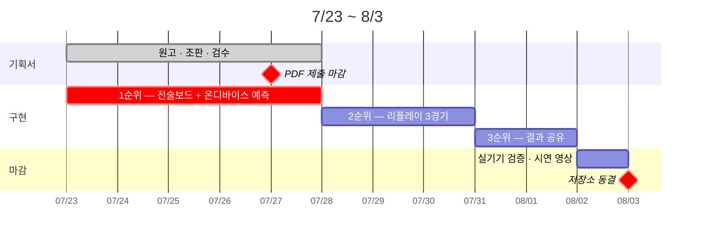

# 14. 실패가 소멸이 아니라 강등이 되게 한다

남은 시간은 12일이다. 이 조건에서 가장 위험한 것은 기능을 적게 만드는 것이 아니라,
**기획서가 약속한 것과 저장소에 있는 것이 어긋나는 것**이다. 그래서 일정과 강등
계획을 함께 적는다.

우선순위는 1절의 약속 범위 그대로다. **1순위(보드 + 예측)의 수용 기준은 타협하지
않고**, 일정이 밀리면 3순위 → 2순위 순으로 축소한다. 축소가 실제로 일어나면 그 사실을
기획서가 아니라 저장소 README에 적는다 — 문서를 고쳐 일치시키는 것이 아니라, 어긋난
상태를 드러내는 쪽이 정직하기 때문이다.

## 리스크마다 대응을 미리 정해 둔다

| 무엇이 잘못될 수 있는가 | 미리 정한 대응 | 근거 |
|:-------------------------------------|:---------------------------------------------------------|:-----------|
| 선례가 없어 성능 기준을 자체 판단할 수 없다 | 빠른 모드(5,000회)를 기본으로 두고 정밀 모드는 옵션. 저성능 기기에서는 반복 수를 자동으로 낮추고 **낮췄다는 사실을 화면에 표기** | P1·P12 |
| 모델 성능이 방어선(RPS 0.19~0.22)에 못 미친다 | 3단 대응 — 피처 축소 → 모델 단순화(앙상블 → 단일 → 로지스틱 기준선) → 그래도 미달이면 **측정값을 그대로 공개**하고 한계 서술을 강화 | P12 |
| 브라우저가 wasm 추론을 지원하지 않는다 | 순수 JS 통계 폴백 + "간이 추정" 배지. 예측 패널은 어떤 환경에서도 비지 않는다 | P4 |
| 공유 API가 지원되지 않는 환경 | 3계층 폴백 — 공유 시트 → 클립보드 (11절) | P8 |
| 공유 카드 렌더가 실패한다 | 기본 브랜드 카드로 대체. 본 기능 무영향 | P8 |
| 시뮬레이션이 오래 걸린다 | 10초 임계에서 진행률과 취소를 상시 제공 | P5·P12 |

표 전체를 관통하는 규칙은 하나다. **실패가 기능의 소멸이 아니라 품질의 강등이 되게
한다.** 어떤 실패 경로에서도 심사자의 화면이 비거나 멈추지 않는다는 것이 이 표의
목적이며, 두 번째 줄 — 성능이 미달하면 수치를 숨기지 않고 공개한다 — 은 특히 지킨다.

## 실동작 검증을 일정에 명시한다

동적 인터랙션이 실제로 작동하지 않으면 평가에서 제외되므로, 8/2 하루를 통째로 실기기
검증에 배정했다. iOS·Android와 데스크톱 주요 브라우저에서 10절의 10분 시나리오를
그대로 재연하고, 7절 지연 예산표에서 〔설계 목표〕로 표시한 두 항목을 계측해 확정한다.
이 단계를 로드맵의 한 칸으로 명시해 둔 이유는, 검증이 "시간이 남으면 하는 일"이 되는
순간 하지 않게 되기 때문이다.
